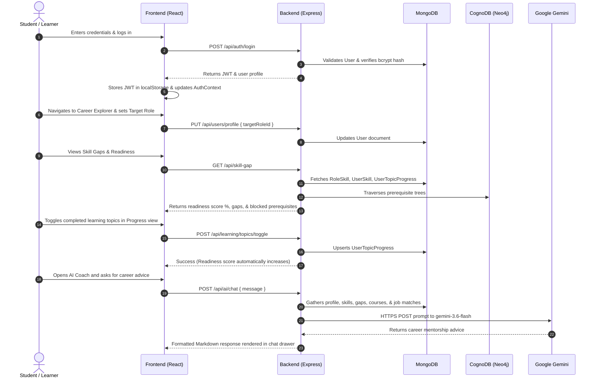

# Software Requirements Specification (SRS) for SkillGraph

## Document Information
- **Project Name**: SkillGraph
- **Document Version**: 1.0.0
- **Document State**: Baseline / Reverse-Engineered from Existing Codebase (Phase 2 & Phase 3)
- **Repository Reference**: `https://github.com/archi-kumari30/Skill-Graph`
- **Source of Truth**: Existing Backend (`Node.js/Express`), Frontend (`React/Vite`), MongoDB Schemas, CognoDB (`Neo4j`) Graph Engine, and `docs/02-Context/` documentation suite.

---

## 1. Introduction

### 1.1 Document Purpose
This Software Requirements Specification (SRS) document details the complete functional, non-functional, domain, architectural, and interface requirements for the **SkillGraph** platform. It serves as the definitive engineering benchmark, systematically distinguishing between functionality that is **CURRENTLY IMPLEMENTED** in the repository and functionality that is **NOT CURRENTLY IMPLEMENTED** (future requirements).

### 1.2 System Overview
SkillGraph is a hybrid relational-graph competency management, career path discovery, and AI mentorship platform. It provides learners (students and practitioners) with tools to inventory technical competencies, evaluate career readiness scores against industry career role baselines, inspect prerequisite dependency graphs, track granular learning topic milestones, receive algorithmic course recommendations, view matched job postings, and engage with a grounded AI career assistant. For organizational managers and administrators, it offers an aggregate team capability matrix to assess collective role readiness and identify capability leaders.

---

## 2. Project Purpose
SkillGraph bridges the disconnect between technical education, individual skill acquisition, and workforce employability. Traditional learning management systems (LMS) treat skills as linear course completions without modeling inter-skill dependencies or calculating objective role readiness. SkillGraph addresses this by introducing a dual-engine architecture (MongoDB transactional store + CognoDB/Neo4j graph engine) that treats skills as nodes in a directed dependency network. This allows learners to clearly understand why a skill is needed, what prerequisites must precede it, what advanced specializations it unlocks, and exactly how proficient they must be to qualify for industry roles.

---

## 3. Problem Statement
1. **Ambiguous Career Prerequisites**: Students and junior engineers frequently struggle to identify the exact technical competencies and dependency sequences required for career transitions (e.g., attempting React without understanding JavaScript closures or the DOM).
2. **Subjective Readiness Assessment**: Learners lack quantitative, transparent benchmarks to measure their readiness for specific job titles, relying instead on subjective self-evaluations.
3. **Fragmented Learning Checklists**: Learners jump between disconnected courses without tracking fine-grained topic mastery (e.g., knowing CSS selectors vs. mastering CSS Flexbox/Grid).
4. **Disconnect Between Skills and Employment**: Job boards present static lists of requirements without matching candidates against those requirements or identifying the specific skills standing between a candidate and an interview.
5. **Organizational Capability Blindspots**: Engineering managers lack centralized tools to evaluate their team's collective capacity against emerging architectural roles or locate subject-matter leads across the organization.

---

## 4. Project Objectives
- **Taxonomic Competency Mapping**: Provide an extensible catalog of technical competencies classified by domain, difficulty, and aliases.
- **Topological Prerequisite Modeling**: Model prerequisites, specializations, and conceptual links in a directed graph structure.
- **Mathematical Readiness Benchmarking**: Compute a weighted readiness score (0–100%) for target career roles that incorporates requirement importance tiers and granular topic checklist completion percentages.
- **Actionable Gap Remediation**: Deliver prioritized next-skill recommendations that prioritize ready-to-learn skills (dependencies satisfied) and down-rank blocked competencies.
- **Contextually Grounded AI Mentorship**: Provide interactive career coaching that incorporates live user profile data, logged proficiencies, and computed skill gaps into prompt context.
- **Team-Wide Skill Intelligence**: Enable managers to analyze collective organizational capabilities and locate capability leads.

---

## 5. Target Users
1. **Students & Learners (`accountRole: 'employee'`)**: Academic students and individual software engineers seeking structured career roadmaps, skill logging, topic tracking, course recommendations, and job matching.
2. **Team Leads & Engineering Managers (`accountRole: 'manager'`)**: Technical managers responsible for evaluating team skill distributions, identifying capability owners, planning training programs, and curating skill/role catalogs.
3. **System Administrators (`accountRole: 'admin'`)**: Platform operators responsible for user administration, catalog seeding, global taxonomy hygiene, and database-to-graph synchronization.

---

## 6. User Roles

### CURRENTLY IMPLEMENTED
The system enforces a strict 3-tier Role-Based Access Control (RBAC) model defined in the `User` schema (`Backend/src/models/User.js`):
1. **`employee` (Default Role / Student)**:
   - Manages personal profile (including academic attributes: college, branch, year of study).
   - Manages personal skill inventory (`UserSkill`) and custom personal skills (`isPersonal: true`).
   - Selects target career role (`targetRoleId`).
   - Views personal skill gaps, readiness score, and prioritized recommendations.
   - Enrolls in learning resources and toggles topic checklist completions (`UserTopicProgress`).
   - Browses job postings with computed compatibility match scores.
   - Interacts with the AI Career Assistant.
2. **`manager`**:
   - Inherits all `employee` capabilities.
   - Accesses organizational team analytics (`/api/team/*` and `/team` view).
   - Evaluates collective team readiness across career roles.
   - Creates, updates, and deletes global skills (`Skill`), relationships (`SkillRelationship`), career roles (`Role`), role skill requirements (`RoleSkill`), companies (`Company`), jobs (`Job`), and learning resources (`LearningResource`).
3. **`admin`**:
   - Superuser inheriting all `manager` capabilities.
   - Views all registered users (`GET /api/users`), inspects user profiles, and deletes user accounts (`DELETE /api/users/:id`).
   - Executes on-demand database-to-graph data synchronization (`POST /api/skill-graph/sync`).

### NOT CURRENTLY IMPLEMENTED
- A dedicated, schema-level `'student'` role enum (students currently register as `'employee'`).
- A dedicated `'recruiter'` or `'hiring_partner'` role for external job management.
- Granular permission sets (capabilities are hardcoded to role string checks rather than dynamic scopes/permissions).

---

## 7. System Scope

### CURRENTLY IMPLEMENTED
- Single-tenant web application encompassing:
  - Client Single Page Application (SPA) built with React 18, Vite, and Tailwind CSS.
  - RESTful API service built with Express 4.19 and Node.js.
  - Dual data tier: MongoDB (Mongoose ODM) + CognoDB (Neo4j Bolt protocol driver).
  - External integration with Google Gemini Generative AI API (`gemini-3.6-flash`).
  - Interactive HTML5 2D Canvas physics visualizer for skill graph exploration.
  - Automatic seed catalog populating 30 skills, 10 roles, 10 companies, 20 jobs, and 30 courses on server boot.

### NOT CURRENTLY IMPLEMENTED
- Multi-tenancy (isolated college cohorts or enterprise workspaces).
- Mobile native clients (iOS/Android).
- Offline-first synchronization or Progressive Web App (PWA) service workers.
- Third-party OAuth authentication (GitHub, Google, LinkedIn).
- Verified skill assessment sandbox (integrated coding challenges or automated tests).

---

## 8. Functional Requirements

### 8.1 User Profile & Student Identity
- **FR-01 (Profile Retrieval)**:
  - *CURRENTLY IMPLEMENTED*: Users can retrieve their profile via `GET /api/users/profile` and session via `GET /api/auth/me`.
- **FR-02 (Academic Credential Storage)**:
  - *CURRENTLY IMPLEMENTED*: Profile records persist academic fields: `college`, `branch`, `yearOfStudy`, `department`, `bio`, and `targetRoleId`.
- **FR-03 (Profile Modification)**:
  - *CURRENTLY IMPLEMENTED*: Users can update their personal information, academic credentials, and target career role via `PUT /api/users/profile` or `PUT /api/auth/me`.
- **FR-04 (Academic Verification)**:
  - *NOT CURRENTLY IMPLEMENTED*: Uploading student ID cards, institutional email domain verification, or academic transcript parsing.

### 8.2 Skills Inventory & Management
- **FR-05 (Catalog Browsing & Search)**:
  - *CURRENTLY IMPLEMENTED*: Paginated retrieval of global skills catalog with category filtering, difficulty filtering, and text search across `name`, `description`, and `aliases` (`GET /api/skills`).
- **FR-06 (Personal Skill Logging)**:
  - *CURRENTLY IMPLEMENTED*: Users can add skills to their profile with proficiency ratings from 1 to 5 (`POST /api/skills/my-skills`).
- **FR-07 (Proficiency Updating & Deletion)**:
  - *CURRENTLY IMPLEMENTED*: Users can modify their proficiency for an existing skill (`PUT /api/skills/my-skills/:skillId`) or remove it (`DELETE /api/skills/my-skills/:skillId`).
- **FR-08 (Custom Personal Skills)**:
  - *CURRENTLY IMPLEMENTED*: If a skill is absent from the global catalog, users can create a personal custom skill flagged `isPersonal: true`, tied to their account (`createdBy: userId`).
- **FR-09 (Skill Verification)**:
  - *NOT CURRENTLY IMPLEMENTED*: Formal skill validation via quizzes, automated coding assessments, or peer endorsements (`UserSkill.verified` remains `false`).

### 8.3 Skill Graph & Visualization
- **FR-10 (Graph Data Retrieval)**:
  - *CURRENTLY IMPLEMENTED*: Returns full graph payload containing all skill nodes (categorized and colored) and directional relationship edges (`GET /api/skill-graph/data`). Indicates whether the authenticated user has logged each skill.
- **FR-11 (Canvas Visualizer)**:
  - *CURRENTLY IMPLEMENTED*: Interactive HTML5 2D Canvas rendering with force-directed physics, node dragging, zoom/pan controls, category filtering, and node selection inspector.
- **FR-12 (Pathfinding & Traversal)**:
  - *CURRENTLY IMPLEMENTED*: Shortest path computation between two skills (`GET /api/skill-graph/paths`) and recursive prerequisite tree extraction (`GET /api/skill-graph/learning-path/:skillId`).
- **FR-13 (Graph Analytics)**:
  - *CURRENTLY IMPLEMENTED*: Calculation of network metrics including node count, edge count, density, and connected components (`GET /api/skill-graph/stats`).
- **FR-14 (Cycle Detection)**:
  - *NOT CURRENTLY IMPLEMENTED*: Automatic cycle detection preventing circular prerequisite creation.

### 8.4 Career Roles & Gap Analysis
- **FR-15 (Role Catalog)**:
  - *CURRENTLY IMPLEMENTED*: Catalog of career roles with departmental categorization and skill requirement definitions (`RoleSkill`) with importance levels (`required`, `important`, `nice_to_have`) and expected proficiency (1–5).
- **FR-16 (Role Compatibility Matching)**:
  - *CURRENTLY IMPLEMENTED*: Multi-role matching evaluating the user's logged competencies against all active roles, returning ranked compatibility percentages (`GET /api/matching/roles`).
- **FR-17 (Mathematical Gap Analysis)**:
  - *CURRENTLY IMPLEMENTED*: Computes readiness percentage for the user's active `targetRoleId` using weighted scoring with importance weights (3, 2, 1) and sub-topic completion multipliers (`GET /api/skill-gap`). Identifies missing skills, partial gaps, and evaluates prerequisite readiness.
- **FR-18 (Career Explorer View)**:
  - *CURRENTLY IMPLEMENTED*: Frontend view (`CareerExplorer.jsx`) allowing users to browse roles, inspect required skills, and set a role as their target with one click.
- **FR-19 (Hierarchical Seniority Tiers)**:
  - *NOT CURRENTLY IMPLEMENTED*: Junior/Mid/Senior role tier variations with graduated skill requirements.

### 8.5 Learning & Progress Tracking
- **FR-20 (Resource Catalog)**:
  - *CURRENTLY IMPLEMENTED*: Educational content catalog mapped to skills (`LearningResource`), capturing resource type, provider, duration, difficulty, and URL.
- **FR-21 (Course Enrollment & Progress)**:
  - *CURRENTLY IMPLEMENTED*: Users can enroll in courses (`POST /api/learning/progress`) and update progress percentage (`0–100%`) and status (`not_started`, `in_progress`, `completed`).
- **FR-22 (Granular Topic Checklists)**:
  - *CURRENTLY IMPLEMENTED*: Users can toggle completion of fine-grained sub-topics (`POST /api/learning/topics/toggle`), which directly scales the effective proficiency formula in `scoring.js`.
- **FR-23 (Prioritized Recommendations)**:
  - *CURRENTLY IMPLEMENTED*: Heuristic recommendation engine scoring next skills based on importance weight, gap magnitude, prerequisite satisfaction bonus (+15), prerequisite unmet penalty (-30), and downstream unlock bonus (+15) (`GET /api/recommendations`).
- **FR-24 (LMS Integration)**:
  - *NOT CURRENTLY IMPLEMENTED*: Automated progress synchronization with Coursera, Udemy, or GitHub; in-app embedded video player; certificate verification.

### 8.6 Job Opportunities & Matching
- **FR-25 (Company & Job Directory)**:
  - *CURRENTLY IMPLEMENTED*: Catalogs companies (`Company`) and job postings (`Job`) with location, job type, salary display string, required skill arrays, and apply URLs.
- **FR-26 (Candidate Compatibility Scoring)**:
  - *CURRENTLY IMPLEMENTED*: Computes candidate skill match percentage for each job posting against the user's logged skills (`GET /api/jobs`), categorizing requirements into matched and missing skills.
- **FR-27 (In-App Applications)**:
  - *NOT CURRENTLY IMPLEMENTED*: Native resume upload, in-app application submission, or application tracking status (`applied`, `interviewing`, `rejected`, `offered`).
- **FR-28 (Dynamic Market Analytics)**:
  - *NOT CURRENTLY IMPLEMENTED*: Dynamic salary percentiles or hiring trend computations (`CareerMarket.jsx` currently displays static mock data).

### 8.7 Team Capability Analytics
- **FR-29 (Team Skills Matrix)**:
  - *CURRENTLY IMPLEMENTED*: Manager/admin view evaluating skill distribution across all registered users, computing user counts, average proficiencies, and maximum proficiencies (`GET /api/team/skills`).
- **FR-30 (Skill Lead Identification)**:
  - *CURRENTLY IMPLEMENTED*: Automatically designates the user with the highest proficiency in each skill as the organizational "Skill Lead".
- **FR-31 (Collective Role Readiness)**:
  - *CURRENTLY IMPLEMENTED*: Evaluates the team as a single collective organism against a target role, calculating team max proficiency for each required skill and identifying organizational gaps (`GET /api/team/readiness/:roleId`).
- **FR-32 (Sub-Team Partitioning)**:
  - *NOT CURRENTLY IMPLEMENTED*: Department-level filtering, project pod creation, or hierarchical reporting structures (`managerId`).

### 8.8 AI Career Assistant
- **FR-33 (Context-Grounded Chat)**:
  - *CURRENTLY IMPLEMENTED*: Conversational chat endpoint (`POST /api/ai/chat`) communicating with Google Gemini API (`gemini-3.6-flash:generateContent`). The system automatically injects user academic background, target role, logged skills, calculated gaps, completed topics, and matched jobs into prompt context.
- **FR-34 (Heuristic Fallback)**:
  - *CURRENTLY IMPLEMENTED*: If the Gemini API key is missing or calls fail, the service executes a rule-based fallback generator producing structured gap advice.
- **FR-35 (Proactive Gap Advice)**:
  - *CURRENTLY IMPLEMENTED*: Non-conversational endpoint (`GET /api/ai/gap-advice`) providing direct recommendations on closing target role gaps.
- **FR-36 (Real-Time Streaming & Persistent History)**:
  - *NOT CURRENTLY IMPLEMENTED*: Token-by-token streaming (SSE/WebSocket) and server-side chat history persistence in MongoDB.

---

## 9. Non-Functional Requirements

### 9.1 Performance
- **NFR-01 (API Response Times)**:
  - *CURRENTLY IMPLEMENTED*: Local MongoDB and Express response times for standard CRUD operations execute in under 100ms.
- **NFR-02 (Canvas Rendering)**:
  - *CURRENTLY IMPLEMENTED*: Canvas maintains 60 FPS for moderate graphs (<100 nodes), but exhibits frame-rate degradation on large graphs due to single-threaded CPU physics calculations.

### 9.2 Reliability & Availability
- **NFR-03 (Graceful Graph Fallback)**:
  - *CURRENTLY IMPLEMENTED*: If the CognoDB/Neo4j graph database is unavailable or disabled, graph query services fall back to MongoDB aggregation pipelines.
- **NFR-04 (Database Reconnection)**:
  - *CURRENTLY IMPLEMENTED*: Mongoose connection includes reconnection logging; unhandled connection rejections trigger clean process termination (`process.exit(1)`).

### 9.3 Maintainability & Code Structure
- **NFR-05 (Architectural Separation)**:
  - *CURRENTLY IMPLEMENTED*: Strict separation of concerns into Routes, Controllers, Services, Models, Middlewares, and Utilities in `Backend/src/`.
- **NFR-06 (Modular Frontend Layout)**:
  - *CURRENTLY IMPLEMENTED*: Reusable UI components (`ProgressBar`, `LoadingSpinner`, `ErrorState`, `EmptyState`, `AIAssistant`) with isolated page views in `Frontend/src/pages/`.

### 9.4 Usability & Accessibility
- **NFR-07 (Responsive UI)**:
  - *CURRENTLY IMPLEMENTED*: Dashboard layout includes a responsive collapsible sidebar, mobile menu toggles, and slide-over drawers built with Tailwind CSS.

---

## 10. Authentication Requirements

### CURRENTLY IMPLEMENTED
- **AUTH-01 (Credential Hashing)**: User passwords hashed via `bcryptjs` with 12 salt rounds before storage.
- **AUTH-02 (Password Masking)**: The `User.password` attribute is defined with `select: false` to prevent accidental leakage in query results.
- **AUTH-03 (Token Format)**: Authentication uses signed JSON Web Tokens (JWT) containing `{ id, role }`, signed with `JWT_SECRET` and expiring according to `JWT_EXPIRES_IN` (default: 24h).
- **AUTH-04 (Token Transport)**: Tokens are transmitted via HTTP header `Authorization: Bearer <token>`.
- **AUTH-05 (Client Storage)**: Tokens are stored in browser `localStorage` under the key `'skillgraph_token'`.
- **AUTH-06 (Session Invalidation)**: Axios response interceptor intercepts HTTP 401 Unauthorized responses, clears `localStorage`, and redirects to `/login`.

### NOT CURRENTLY IMPLEMENTED
- **AUTH-07 (Refresh Token Rotation)**: Refresh tokens and silent background token rotation are not implemented; users must re-authenticate upon token expiration.
- **AUTH-08 (Server-Side Blacklist)**: Token revocation via Redis blocklist is not implemented.
- **AUTH-09 (Email Verification)**: Account activation via email links or OTP is not implemented.
- **AUTH-10 (Self-Service Password Reset)**: "Forgot Password" email workflows are not implemented.
- **AUTH-11 (Multi-Factor Authentication)**: MFA / 2FA workflows (TOTP/SMS) are not implemented.

---

## 11. Authorization / RBAC Requirements

### CURRENTLY IMPLEMENTED
- **RBAC-01 (Authentication Guard)**: `authMiddleware.authenticate` verifies the JWT Bearer token and attaches the authenticated Mongoose user record to `req.user`.
- **RBAC-02 (Role Authorization Guard)**: `authMiddleware.authorize(...roles)` verifies that `req.user.accountRole` matches the permitted roles, returning HTTP 403 Forbidden on failure.
- **RBAC-03 (Client Route Protection)**:
  - `PrivateRoute`: Blocks unauthenticated users, redirecting to `/login`.
  - `PublicRoute`: Blocks authenticated users from `/login` and `/register`, redirecting to `/dashboard`.
  - `RoleRoute`: Restricts `/team` navigation strictly to `admin` and `manager` roles, redirecting unauthorized users to `/dashboard`.
- **RBAC-04 (Resource Ownership Enforcements)**: Profile updates, personal skill logging, course enrollments, and topic toggles strictly enforce `req.user._id` ownership.

### NOT CURRENTLY IMPLEMENTED
- **RBAC-05 (Dynamic Permissions)**: Dynamic permission/claims-based access control (e.g. `skills:create`, `team:read`) is not implemented; access is determined by role string comparisons.

---

## 12. Skill Management Requirements

### CURRENTLY IMPLEMENTED
- **SKILL-01 (Domain Taxonomy)**: Enforces category classification across 9 domains (`frontend`, `backend`, `devops`, `database`, `mobile`, `ai-ml`, `cloud`, `security`, `other`).
- **SKILL-02 (Difficulty Levels)**: Supports `beginner`, `intermediate`, and `advanced` difficulty classifications.
- **SKILL-03 (Text Search)**: MongoDB text index over `name`, `description`, and `aliases` for search queries.
- **SKILL-04 (Personal Skills)**: Individual users can create custom skills flagged `isPersonal: true`.
- **SKILL-05 (Proficiency Scale)**: Bounded 1 to 5 integer scale for self-assessed proficiency.
- **SKILL-06 (Catalog Administration)**: Creation, modification, and deletion of global canonical skills (`isPersonal: false`) restricted to `admin` and `manager`.

### NOT CURRENTLY IMPLEMENTED
- **SKILL-07 (Skill Verification)**: Automated verification through technical testing or credential proof.
- **SKILL-08 (Skill Versioning)**: Distinct version branches (e.g. React 16 vs React 18, Python 2 vs 3).

---

## 13. Skill Graph Requirements

### CURRENTLY IMPLEMENTED
- **GRAPH-01 (Relationship Modeling)**: Directed edges stored in `SkillRelationship` modeling `prerequisite`, `related`, and `specialization` with weights from 0.1 to 1.0.
- **GRAPH-02 (Unique Edge Index)**: Compound unique index `{ fromSkillId: 1, toSkillId: 1, relationType: 1 }` prevents redundant identical edges.
- **GRAPH-03 (Self-Referential Edge Guard)**: Backend validates that `fromSkillId !== toSkillId`.
- **GRAPH-04 (Dual-Engine Operation)**: Traverses relationships via Neo4j Bolt driver when `USE_GRAPH_DB === 'true'`, falling back to MongoDB aggregation pipelines.
- **GRAPH-05 (Physics Visualizer)**: 2D HTML5 canvas visualizer simulating spring tension and node repulsion.

### NOT CURRENTLY IMPLEMENTED
- **GRAPH-06 (Cycle Detection Guard)**: Directed Acyclic Graph (DAG) cycle checking is not implemented; circular prerequisites can be created if not prevented manually.
- **GRAPH-07 (WebGL Acceleration)**: Visualizer does not use WebGL (Three.js/Pixi.js/Cytoscape), causing performance bottlenecks on dense topologies.

---

## 14. Career Readiness Requirements

### CURRENTLY IMPLEMENTED
- **CAREER-01 (Role Directory)**: Stores career roles (`Role`) across departments.
- **CAREER-02 (Requirement Mapping)**: Maps required skills to roles (`RoleSkill`) with expected proficiency (1–5) and importance tiers (`required`: 3, `important`: 2, `nice_to_have`: 1).
- **CAREER-03 (Weighted Scoring Formula)**:
  $$\text{Effective Proficiency} = \text{Current Proficiency} \times \min\left(1.0, \frac{\text{Completed Topics}}{\text{Total Topics}}\right)$$
  $$\text{Readiness Score} = \left(\frac{\sum (\text{Effective Proficiency} \times \text{Weight})}{\sum (\text{Expected Proficiency} \times \text{Weight})}\right) \times 100$$
- **CAREER-04 (Prerequisite Dependency Validation)**: Flags gap skills as either "Ready to Learn" (all prerequisites satisfied) or "Blocked" (missing upstream prerequisites).
- **CAREER-05 (Role Matching)**: Ranks all system roles by compatibility percentage against the user's skill set (`GET /api/matching/roles`).

### NOT CURRENTLY IMPLEMENTED
- **CAREER-06 (Seniority Variations)**: Tiered competency profiles for Junior, Mid, and Senior levels under a single role title.
- **CAREER-07 (Skill Decay)**: Forgetting-curve algorithms that degrade proficiency ratings if not practiced over time.

---

## 15. Learning Requirements

### CURRENTLY IMPLEMENTED
- **LEARN-01 (Resource Directory)**: Catalogs educational content (`LearningResource`) with provider, duration, difficulty, and URL.
- **LEARN-02 (Enrollment & Progress Tracking)**: Tracks course enrollment, status lifecycle (`not_started`, `in_progress`, `completed`), and completion percentages.
- **LEARN-03 (Topic Checklists)**: Users toggle granular topic mastery flags (`UserTopicProgress`), directly updating user proficiency ratings and career readiness formulas in real time.
- **LEARN-04 (Heuristic Recommendation Engine)**: Ranks recommended skills using formula:
  $$\text{Score} = \text{Base Weight} + (\text{Gap} \times 8) + \text{Prerequisite Bonus/Penalty} + \text{Unlock Bonus}$$
- **LEARN-05 (Guided Career Learning Paths)**: Inspired by the Naukri Code 360 reference model, generates personalized guided paths (`GET /api/jobs/:id/learning-path`) structured into chapters, topics, and resources. Foundational prerequisites are ordered topologically using Kahn's algorithm so prerequisite competencies appear in earlier chapters than dependent competencies.

### NOT CURRENTLY IMPLEMENTED
- **LEARN-06 (LMS Integration)**: External course platform progress synchronization via API webhooks.

---

## 16. Job Architecture & Matching Requirements

### CURRENTLY IMPLEMENTED
- **JOB-01 (Company Directory)**: Catalogs corporate employers with industry, website, and description.
- **JOB-02 (Structured Job Requirements)**: Stores job opportunities with titles, work modes (`Remote`, `Hybrid`, `On-site`), employment types (`Full Time`, `Part Time`, `Internship`, `Contract`), experience, salary ranges, deadlines, optional education requirements (`degree`, `branch`, `minGraduationYear`, `minCgpa`), and structured skill requirement buckets (`Required`, `Important`, `Nice to Have`) with expected proficiency benchmarks (1–5).
- **JOB-03 (Deterministic Weighted Compatibility Matching)**: Computes candidate compatibility match score using weighted contribution formula:
  $$\text{Match Score} = \left(\frac{\sum (\text{Importance Weight} \times \text{Proficiency Ratio})}{\sum \text{Importance Weight}}\right) \times 100$$
  where $\text{Proficiency Ratio} = \min\left(1.0, \frac{\text{Current Proficiency}}{\text{Expected Proficiency}}\right)$ and Importance Weights are Required: 3, Important: 2, Nice to have: 1.
- **JOB-04 (Prerequisite DAG Analysis & Blocked Status)**: Traverses `SkillRelationship` directed acyclic graph to categorize skills into 4 distinct statuses:
  - **Matched (✓)**: Current proficiency meets or exceeds expected benchmark.
  - **Partial (⚠)**: Candidate possesses skill but proficiency is lower than required level.
  - **Missing (✗)**: Candidate does not possess skill, but all graph prerequisites are satisfied.
  - **Blocked (✗ Blocked)**: Candidate does not possess skill AND is missing upstream prerequisites, exposing the exact causal prerequisite chain (e.g. Advanced React $\rightarrow$ React $\rightarrow$ JavaScript).
- **JOB-05 (In-App Applications Lifecycle)**: Native job application pipeline (`JobApplication` model, `POST /api/jobs/:id/apply`, `GET /api/applications/my`) supporting optional resume URLs and cover letters, duplicate application prevention via compound unique index `{ userId: 1, jobId: 1 }` (HTTP 409), closed job application blocks (HTTP 400), and status progression (`applied`, `under_review`, `shortlisted`, `interview`, `offered`, `rejected`, `withdrawn`).
- **JOB-06 (Manager/Admin Job Management Console)**: Dedicated management interface (`/admin/jobs` with `RoleRoute`) allowing managers and admins to post new jobs, manage listings, toggle active/closed states, and interactively build structured skill requirement buckets.
- **JOB-07 (Dynamic Salary & Work Mode Filtering)**: Supports numeric range filtering (`salaryMin`, `salaryMax`), work mode, and text search across titles and descriptions.

### NOT CURRENTLY IMPLEMENTED
- **JOB-08 (Automated External Job Board Web Scrapers)**: Live scraping daemon from LinkedIn/Indeed.

---

## 17. Team Analysis Requirements

### CURRENTLY IMPLEMENTED
- **TEAM-01 (Role Restriction)**: Endpoints restricted to `admin` and `manager` roles via `authMiddleware.authorize`.
- **TEAM-02 (Team Capability Matrix)**: Aggregates skills across all users to compute member counts, average proficiency, and max proficiency.
- **TEAM-03 (Skill Lead Identification)**: Automatically identifies the team member with the highest proficiency as the "Skill Lead" for each competency.
- **TEAM-04 (Collective Role Readiness)**: Evaluates the entire team as a single collective unit against any career role (`GET /api/team/readiness/:roleId`), finding maximum team proficiency for each required skill.

### NOT CURRENTLY IMPLEMENTED
- **TEAM-05 (Organizational Hierarchy)**: User-to-manager reporting relationships (`managerId` in `User`).
- **TEAM-06 (Sub-Team Partitioning)**: Filtering capability analytics by department, cohort, or custom project teams (all users are currently evaluated as a single monolithic team).

---

## 18. AI Assistant Requirements

### CURRENTLY IMPLEMENTED
- **AI-01 (Grounding Prompt Synthesis)**: Ingests user academic profile, target role, logged skills, calculated gaps, completed topic counts, enrolled courses, and matched jobs into prompt context.
- **AI-02 (Gemini API Integration)**: Communicates with Google's Gemini API (`gemini-3.6-flash:generateContent`) via native Node.js `https.request`.
- **AI-03 (Rule-Based Fallback)**: If `GEMINI_API_KEY` is not configured or calls fail, generates heuristic career advice based on the user's specific skill gaps.
- **AI-04 (Interactive Chat Drawer)**: Slide-over chat interface (`AIAssistant.jsx`) accessible across all authenticated dashboard views.

### NOT CURRENTLY IMPLEMENTED
- **AI-05 (Official SDK Integration)**: The service uses raw `https.request` rather than the official `@google/genai` or `@google/generative-ai` SDKs.
- **AI-06 (Real-Time Token Streaming)**: Responses are delivered as a single blocking payload; Server-Sent Events (SSE) or WebSocket streaming is not implemented.
- **AI-07 (Persistent Chat Storage)**: Chat history is stored in React component state; database persistence across sessions is not implemented.

---

## 19. Database Requirements

### CURRENTLY IMPLEMENTED
- **DB-01 (Document Store)**: MongoDB (v8.3+) managed via Mongoose ODM, utilizing 11 distinct schemas:
  `User`, `Skill`, `SkillRelationship`, `UserSkill`, `Role`, `RoleSkill`, `Company`, `Job`, `LearningResource`, `LearningProgress`, `UserTopicProgress`.
- **DB-02 (Compound Unique Indexes)**: Prevents duplicate records at the database engine level:
  - `UserSkill`: `{ userId: 1, skillId: 1 }`
  - `SkillRelationship`: `{ fromSkillId: 1, toSkillId: 1, relationType: 1 }`
  - `RoleSkill`: `{ roleId: 1, skillId: 1 }`
  - `LearningProgress`: `{ userId: 1, resourceId: 1 }`
  - `UserTopicProgress`: `{ userId: 1, skillId: 1, topicId: 1 }`
- **DB-03 (Graph Engine Integration)**: CognoDB / Neo4j (v6.2+) integration via official Bolt driver (`neo4j-driver`) with automatic MongoDB-to-Neo4j data synchronization on boot.
- **DB-04 (Automatic Seed Catalog)**: Idempotent seeder (`seedCatalog.js`) automatically populating foundational catalog records on server boot.

### NOT CURRENTLY IMPLEMENTED
- **DB-05 (Dual-Write Consistency)**: Real-time transactional two-phase commit across MongoDB and Neo4j during CRUD operations is not implemented (Neo4j synchronization occurs on boot or manual trigger).
- **DB-06 (Database Migrations)**: Automated schema migration framework (e.g. `migrate-mongo`) is not implemented.
- **DB-07 (Soft Deletes)**: Soft deletion patterns (`deletedAt`) are not implemented; deletions perform physical Mongoose removals.

---

## 20. Frontend Requirements

### CURRENTLY IMPLEMENTED
- **FE-01 (Single Page Architecture)**: Built using React 18, Vite 5, and React Router DOM 6.23.
- **FE-02 (Styling System)**: Styled using Tailwind CSS 3.4 with custom theme tokens and PostCSS.
- **FE-03 (Client State & Context)**: Global authentication state managed via `AuthContext.jsx`.
- **FE-04 (Data Visualization)**: Visual charts rendered using Recharts (radial progress, radar comparisons, bar charts).
- **FE-05 (Iconography)**: Clean UI icons provided by Lucide React.
- **FE-06 (HTTP API Client)**: Centralized Axios instance (`Frontend/src/services/api.js`) with request/response interceptors.
- **FE-07 (Routing & Layouts)**: Master router in `App.jsx` utilizing `DashboardLayout.jsx` with responsive sidebar and slide-over AI drawer.

### NOT CURRENTLY IMPLEMENTED
- **FE-08 (Automated Frontend Testing)**: Unit/integration tests (Jest, Vitest, React Testing Library) or E2E tests (Playwright, Cypress) are not implemented for the frontend.
- **FE-09 (State Management Library)**: External state management (Redux Toolkit, Zustand, TanStack Query) is not implemented; data fetching relies on component-level `useEffect` hooks.

---

## 21. Backend & API Requirements

### CURRENTLY IMPLEMENTED
- **BE-01 (Web Framework)**: Node.js (v18+) and Express 4.19.
- **BE-02 (RESTful Architecture)**: 13 route namespaces mounted under `/api` in `Backend/src/app.js`.
- **BE-03 (Global Error Handling)**: Centralized Express error handler (`errorMiddleware.js`) converting exceptions into standardized JSON responses with error classes (`AppError`, `ValidationError`, `NotFoundError`, etc.).
- **BE-04 (Security Middleware)**: HTTP header hardening via `helmet`, cross-origin control via `cors`, and IP rate limiting via `express-rate-limit` (100 requests per 15 min).
- **BE-05 (Logging)**: HTTP request logging via `morgan`.

### NOT CURRENTLY IMPLEMENTED
- **BE-06 (Automated API Documentation)**: Interactive API documentation (Swagger / OpenAPI) is not implemented.
- **BE-07 (Distributed Rate Limiting)**: Rate limiter uses in-memory storage; distributed Redis-backed rate limiting is not implemented.

---

## 22. Security Requirements

### CURRENTLY IMPLEMENTED
- **SEC-01 (Password Encryption)**: Passwords hashed using bcrypt with 12 salt rounds.
- **SEC-02 (Credential Masking)**: User passwords excluded from default queries via `select: false`.
- **SEC-03 (HTTP Security Headers)**: Helmet enabled for XSS, MIME sniffing, and clickjacking protection.
- **SEC-04 (CORS Configuration)**: Configured via environment variables (`CLIENT_URL`).
- **SEC-05 (Environment Sanitization)**: Secret keys (`JWT_SECRET`, `MONGODB_URI`, `GEMINI_API_KEY`) loaded from `.env` and excluded from git tracking.

### NOT CURRENTLY IMPLEMENTED
- **SEC-06 (Input Sanitization Middleware)**: Request body sanitization against NoSQL injection (e.g. `express-mongo-sanitize`) or XSS sanitization (e.g. `xss-clean`) is not implemented.
- **SEC-07 (CSRF Protection)**: CSRF tokens are not implemented (mitigated by stateless Bearer token authorization, but vulnerable if tokens are stored unsafely).
- **SEC-08 (Content Security Policy)**: CSP headers are not customized for canvas scripts and external CDNs.

---

## 23. Deployment Requirements

### CURRENTLY IMPLEMENTED
- **DEP-01 (Vercel SPA Rewrites)**: Root-level `vercel.json` and `Frontend/vercel.json` configured with rewrite rule `{"source": "/(.*)", "destination": "/index.html"}` to support HTML5 pushState client routing.
- **DEP-02 (Environment Variable Management)**: Structured `.env.example` templates in `Backend/` defining all required configuration keys.
- **DEP-03 (NPM Scripts)**: Standardized scripts for development (`npm run dev`), production starting (`npm start`), and test execution (`npm test`).

### NOT CURRENTLY IMPLEMENTED
- **DEP-04 (Containerization)**: Dockerfiles and Docker Compose configurations are not implemented.
- **DEP-05 (CI/CD Pipelines)**: GitHub Actions workflows for automated linting, test execution, and deployment are not implemented.
- **DEP-06 (Production Process Management)**: PM2 configuration or Kubernetes deployment manifests are not implemented.

---

## 24. Current System Workflows

---

## 25. Current Limitations Summary
The following capabilities are explicitly **NOT CURRENTLY IMPLEMENTED** in the current SkillGraph codebase:
1. **Student Identity**: Dedicated `'student'` role enum does not exist; students register under `accountRole: 'employee'`.
2. **Skill Assessments**: Formal verification of logged skills via tests or certificates is absent (`verified` is always `false`).
3. **Session Management**: Refresh token rotation and server-side token revocation are absent.
4. **Account Lifecycle**: Email verification and self-service password reset ("Forgot Password") are absent.
5. **Learning Taxonomy**: Granular sub-topics are defined in static client arrays and scoring dictionaries rather than dynamic database entities.
6. **Market Analytics**: Dynamic market trends and salary aggregations are absent (`CareerMarket.jsx` renders static mock data).
7. **Job Applications**: In-app application submissions and tracking pipelines are absent; jobs rely on external apply URLs.
8. **AI Streaming & Persistence**: Real-time token streaming and database-persisted chat histories are absent.
9. **Team Hierarchy**: Organizational hierarchy, direct report assignments, and sub-team partitioning are absent (all users are evaluated as a single monolithic team).
10. **Automated Testing & CI/CD**: Frontend test suites, automated E2E tests, Docker containerization, and CI/CD pipelines are absent.
