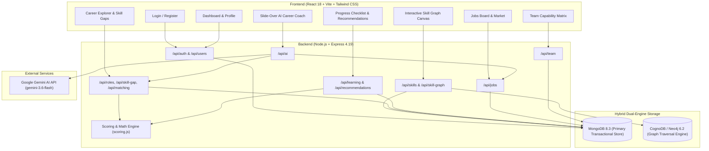

# SkillGraph: Technical Context Documentation Index

## Overview
This documentation suite forms **Phase 2 (Context)** of the SkillGraph engineering lifecycle. It captures the exact, unembellished state of the existing codebase as the authoritative **source of truth**. No application code has been altered, no imaginary endpoints or schema fields have been introduced, and all non-implemented features are explicitly documented as **"Not currently implemented."**

SkillGraph is an enterprise-grade and student-oriented skill taxonomy, career path mapping, role readiness scoring, and AI-assisted technical mentorship platform. It operates on a hybrid dual-engine architecture combining MongoDB for transactional persistence with CognoDB (Neo4j) for graph traversals and prerequisite pathfinding.

---

## Complete Module Structure & Navigation

| Document | Primary Focus | Primary Database Models | Key Frontend Views |
| :--- | :--- | :--- | :--- |
| **[project-context.md](./project-context.md)** | System-wide architecture, runtime lifecycle, dependencies, and environment configuration. | Global (All 11 Models) | Application Shell (`App.jsx`, `DashboardLayout.jsx`) |
| **[database-context.md](./database-context.md)** | MongoDB Mongoose ODM schemas, compound indexes, and Neo4j CognoDB graph synchronization. | All Collections + Graph Nodes/Edges | `SkillGraph.jsx` |
| **[authentication-context.md](./authentication-context.md)** | Stateless JWT session management, bcrypt hashing, and Role-Based Access Control (RBAC). | `User`, `Role` | `Login.jsx`, `Register.jsx`, `AuthContext.jsx` |
| **[student-context.md](./student-context.md)** | Student identity (`accountRole: 'employee'`), academic fields, skills inventory, and personal dashboard. | `User`, `UserSkill`, `Role` | `Profile.jsx`, `Dashboard.jsx`, `MySkills.jsx` |
| **[skills-context.md](./skills-context.md)** | Technical skills catalog, personal custom skills, graph relationships, and HTML5 Canvas visualizer. | `Skill`, `SkillRelationship`, `UserSkill` | `SkillGraph.jsx`, `SkillDetail.jsx`, `MySkills.jsx` |
| **[career-context.md](./career-context.md)** | Career role benchmarks, importance weighting, gap analysis, and multi-role compatibility matching. | `Role`, `RoleSkill`, `UserSkill`, `UserTopicProgress` | `CareerExplorer.jsx`, `SkillGaps.jsx` |
| **[learning-context.md](./learning-context.md)** | Educational content catalog, course progress, granular topic checklists, and recommendation engine. | `LearningResource`, `LearningProgress`, `UserTopicProgress` | `Progress.jsx`, `Recommendations.jsx` |
| **[job-matching-context.md](./job-matching-context.md)** | Corporate directories, job vacancies, and automated skill-based compatibility scoring. | `Company`, `Job`, `UserSkill`, `Skill` | `Jobs.jsx`, `CareerMarket.jsx` |
| **[team-analysis-context.md](./team-analysis-context.md)** | Manager-only organizational talent matrices, collective role readiness, and skill leads. | `User`, `UserSkill`, `Role`, `RoleSkill` | `TeamAnalysis.jsx` |
| **[ai-assistant-context.md](./ai-assistant-context.md)** | Context-aware AI career coaching powered by Google Gemini, grounded in live user profile state. | Cross-module context synthesis | `AIAssistant.jsx` |

---

## System Architecture & Inter-Module Interaction

The diagram below illustrates how data and control flow across the system modules:

---

## Core System Lifecycles & Cross-Module Workflows

### 1. The Student Readiness Lifecycle
1. **Academic Enrollment**: A student registers (`POST /api/auth/register`) with `accountRole: 'employee'`, configuring their `college`, `branch`, and `yearOfStudy`.
2. **Competency Logging**: The student logs self-assessed technical skills (`POST /api/skills/my-skills`) with proficiency ratings (1-5).
3. **Career Targeting**: The student explores career roles in `CareerExplorer.jsx` and commits to a `targetRoleId`.
4. **Gap Analysis & Path Calculation**:
   - `skillGapService.js` compares `UserSkill` vs `RoleSkill`.
   - `scoring.js` applies the weighted readiness formula incorporating importance weights (`required`: 3, `important`: 2, `nice_to_have`: 1).
   - `recommendationService.js` evaluates prerequisite trees in `SkillRelationship` and scores next-step learning actions.
5. **Milestone Progression**:
   - The student completes sub-topics in `Progress.jsx` (`POST /api/learning/topics/toggle`).
   - The topic completion rate multiplier directly raises the effective proficiency score in `scoring.js`, dynamically boosting the student's target role readiness score on the Dashboard.
6. **Career Transition**: The student views matched job opportunities in `Jobs.jsx` ranked by skill compatibility.

### 2. The Organizational Capability Lifecycle (Managers & Admins)
1. **Aggregated Ingestion**: The system continuously aggregates all logged `UserSkill` records across all employees.
2. **Team Role Simulation**: In `TeamAnalysis.jsx`, a manager selects any career role.
3. **Collective Organism Evaluation**: `teamService.js` identifies the maximum proficiency held by any team member for each required competency, designating the top individual as the "Skill Lead".
4. **Deficit Remediation**: The organization uncovers collective vulnerabilities where `teamMaxProficiency < expectedProficiency` and initiates targeted training.

### 3. The Grounded AI Mentorship Lifecycle
1. When the student opens the `AIAssistant.jsx` drawer, `aiService.js` queries live data from `User`, `UserSkill`, `Role`, `UserTopicProgress`, `LearningProgress`, and `Job`.
2. Synthesizes a structured system prompt grounded in the student's live academic profile, target role gaps, active courses, and job matches.
3. Invokes Google Gemini API (`gemini-3.6-flash:generateContent`).
4. If external credentials or APIs fail, gracefully falls back to an internal heuristic response generator based on the user's specific skill gap data.

---

## Role-Based Access Control (RBAC) Matrix

| Resource / Capability | `admin` | `manager` | `employee` (Student) | Public / Unauth |
| :--- | :---: | :---: | :---: | :---: |
| Register / Login | Yes | Yes | Yes | Yes |
| View Personal Profile & Dashboard | Yes | Yes | Yes | No |
| Log Personal Skills & Custom Skills | Yes | Yes | Yes | No |
| Explore Public Skills & Canvas Graph | Yes | Yes | Yes | Yes |
| Create / Delete Global Canonical Skills | Yes | Yes | No | No |
| Create / Delete Skill Relationships | Yes | Yes | No | No |
| Explore Career Roles & Skill Gaps | Yes | Yes | Yes | No |
| Create / Edit Career Roles (`RoleSkill`) | Yes | Yes | No | No |
| Enroll in Courses & Toggle Topics | Yes | Yes | Yes | No |
| Create / Edit Learning Resources | Yes | Yes | No | No |
| View Job Listings with Match Scores | Yes | Yes | Yes | No |
| Create / Edit Company & Job Listings | Yes | Yes | No | No |
| Access Team Capability Analytics (`/team`)| Yes | Yes | No | No |
| Delete User Accounts | Yes | No | No | No |
| Trigger Database-to-Neo4j Graph Sync | Yes | No | No | No |

---

## Summary of Known System Limitations
For comprehensive details, refer to section **11 (Current Limitations)** of each respective module document. A high-level summary of items **Not currently implemented** in the existing codebase:

1. **Student Identity**: Dedicated `'student'` role does not exist; student identity is folded into `accountRole: 'employee'`.
2. **Authentication**: Refresh token rotation, email verification, self-service password reset, MFA/2FA, and OAuth/SSO are **Not currently implemented**.
3. **Skill Verification**: Self-assessed skills have `verified: false`; formal verification workflows (assessments, peer endorsement, certificates) are **Not currently implemented**.
4. **Learning Taxonomy**: Sub-topics are hardcoded in client code and scoring dictionaries rather than being modeled as dynamic database entities.
5. **Market Trends**: `CareerMarket.jsx` renders static hardcoded sample data rather than dynamic market aggregations.
6. **Job Applications**: Native application submission and tracking are **Not currently implemented**; jobs redirect to external URLs.
7. **AI Streaming & History**: Real-time token streaming and persistent database storage for chat history are **Not currently implemented**.
8. **Team Partitioning**: Team analytics aggregates all users globally; organizational hierarchy and sub-team partitioning are **Not currently implemented**.
