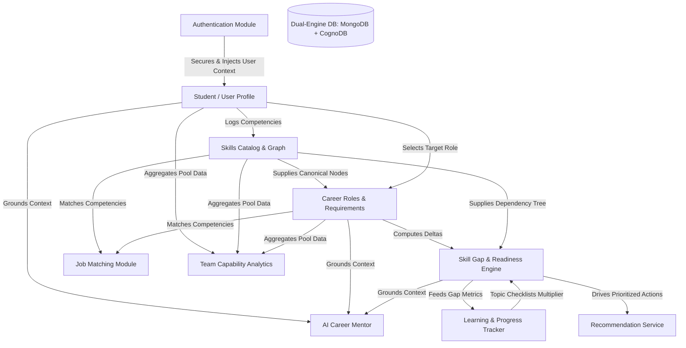

# SkillGraph: Project-Wide Architectural Context

## 1. Module Name
**SkillGraph System Core & Architectural Foundation** (Global Project Context)

---

## 2. Purpose
SkillGraph is a hybrid relational-graph platform designed for skill mapping, career path discovery, skill gap analysis, personalized learning progression, and job market readiness scoring. It allows individual learners/students (represented by `accountRole: 'employee'`) to inventory their technical competencies, inspect prerequisites and specializations across interactive visual graphs, evaluate their readiness against target career roles, track topic-level learning milestones, and receive deterministic algorithmic recommendations and AI-powered mentorship. Simultaneously, it allows organization managers and administrators to view aggregate team competency matrices, identify collective skill deficiencies, and manage organizational talent catalogs.

---

## 3. Current Functionality
- **Dual-Engine Architecture**: Operates primarily on MongoDB (Mongoose ODM) with optional synchronization to Neo4j (CognoDB graph database) for native graph traversal.
- **Role-Based Access Control (RBAC)**: Distinguishes between three system roles: `admin`, `manager`, and `employee` (which serves as the student/individual practitioner role).
- **Interactive Visual Skill Graph**: HTML5 Canvas-based graph rendering nodes (skills, categories, personal skills) and directed relationship edges (`prerequisite`, `related`, `specialization`).
- **Mathematical Career Readiness Scoring**: Multi-factor scoring engine evaluating user proficiency, requirement weights (`required`, `important`, `nice_to_have`), and granular topic checklist completion percentages.
- **Dynamic Skill Gap Engine**: Automatically compares user competencies against career role baselines, computing proficiency deltas, missing prerequisite chains, and priority rankings.
- **Topological Learning Path Recommendations**: Recommends next-step skills by balancing importance, gap magnitude, prerequisite readiness penalties, and downstream unlock bonuses.
- **Granular Learning Progress Tracker**: Tracks individual topic completions (e.g., HTML Basics, Semantic HTML, CSS Flexbox) and course resource enrollments.
- **Job Matching Matrix**: Calculates compatibility percentages between learner competencies and job postings across industry companies.
- **AI Career Assistant**: Integration with Google Gemini (`gemini-3.6-flash:generateContent`) delivering personalized guidance grounded in real-time user profile metrics, skills, enrolled courses, and target gaps.
- **Team Capability Analytics**: Evaluates organization-wide talent pools, identifies capability owners/leads, and detects missing skills for managers.
- **Automated Catalog Seeding**: Idempotent startup seeder (`seedCatalog.js`) ensuring standard roles, skills, relationships, companies, jobs, and learning resources exist on server boot.

---

## 4. Frontend Files Involved
- `Frontend/src/main.jsx`: Application bootstrap mounting React DOM into `#root`.
- `Frontend/src/App.jsx`: Master router defining all public, private, and role-guarded routes.
- `Frontend/src/layouts/DashboardLayout.jsx`: Core responsive wrapper housing the sidebar, navigation tabs, user badge, and AI Assistant slide-over drawer.
- `Frontend/src/context/AuthContext.jsx`: Global authentication and session provider.
- `Frontend/src/services/api.js`: Unified Axios HTTP client with JWT interceptors, error extraction, and endpoint wrappers.
- `Frontend/src/components/LoadingSpinner.jsx`: Consistent loading indicator.
- `Frontend/src/components/ErrorState.jsx`: User-facing error display with retry triggers.
- `Frontend/src/components/EmptyState.jsx`: Blank-slate placeholder component.
- `Frontend/src/components/ProgressBar.jsx`: Multi-variant visual progress bar.
- `Frontend/src/components/AIAssistant.jsx`: Floating chat interface communicating with Gemini AI.
- `Frontend/src/assets/index.css`: Tailwind CSS imports and custom utility styles.
- `Frontend/vite.config.js`: Vite build configuration specifying React plugin and proxy settings.
- `Frontend/tailwind.config.js`: Tailwind theme configurations and color tokens.
- `Frontend/vercel.json`: Single Page Application (SPA) rewrite rules for client routing.
- `vercel.json` (Root): Root-level fallback rewrite routing.

---

## 5. Backend Files Involved
- `Backend/src/server.js`: Entry point managing HTTP server creation, MongoDB connection, CognoDB/Neo4j graph synchronization, database seeding, and graceful shutdown listeners.
- `Backend/src/app.js`: Express application setup, security middleware (`helmet`, `cors`, `rateLimit`), JSON parsing, request logging (`morgan`), and route mounting.
- `Backend/src/config/config.js`: Centralized environment variable validator and configuration registry.
- `Backend/src/config/db.js`: Mongoose connection manager with retry logic and lifecycle listeners.
- `Backend/src/config/cognodb.js`: Neo4j driver initialization for CognoDB graph database integration.
- `Backend/src/middleware/authMiddleware.js`: JWT token verification (`authenticate`) and role authorization gates (`authorize`).
- `Backend/src/middleware/errorMiddleware.js`: Global error handler converting exceptions to structured JSON responses.
- `Backend/src/utils/customErrors.js`: Standardized error hierarchy (`AppError`, `NotFoundError`, `ValidationError`, `UnauthorizedError`, `ForbiddenError`, `ConflictError`).
- `Backend/src/utils/helpers.js`: Pagination, sorting, response formatting, and slugification utilities.
- `Backend/src/utils/scoring.js`: Weighted readiness calculations, topic multipliers, and recommendation scoring algorithms.
- `Backend/src/seed/seedCatalog.js`: Startup catalog seeder for skills, roles, relationships, companies, jobs, and learning materials.
- `Backend/src/seed/seed.js`: Standalone comprehensive database seeder script.
- `Backend/src/seed/seedGraph.js`: Standalone script to populate CognoDB / Neo4j graph instances.

---

## 6. APIs Involved
The system registers 13 specialized REST route namespaces under the `/api` prefix in `Backend/src/app.js`:
- `/api/auth` -> `authRoutes.js` (User registration, login, session inspection)
- `/api/users` -> `userRoutes.js` (User profiles, password updates, account administration)
- `/api/skills` -> `skillRoutes.js` (Skill catalog, user skills inventory, custom skills)
- `/api/skill-graph` -> `skillGraphRoutes.js` (Nodes, edges, pathfinding, canvas data)
- `/api/roles` -> `roleRoutes.js` (Career role definitions, required skills, CRUD)
- `/api/skill-gap` -> `skillGapRoutes.js` (Role-specific gap analysis and missing prerequisites)
- `/api/recommendations` -> `recommendationRoutes.js` (Prioritized next skills and learning items)
- `/api/matching` -> `matchingRoutes.js` (Role compatibility ranking across all system roles)
- `/api/team` -> `teamRoutes.js` (Manager-only team competency matrices and role readiness)
- `/api/dashboard` -> `dashboardRoutes.js` (Aggregated dashboard metrics for current user)
- `/api/jobs` -> `jobRoutes.js` (Company jobs, job-to-user skill matches, job details)
- `/api/learning` -> `learningRoutes.js` (Learning resources, course progress, topic checklists)
- `/api/ai` -> `aiRoutes.js` (AI-powered career mentor chat and gap advice)
- `/api/health` -> Inline Express route returning system uptime and timestamp.

---

## 7. Database Models Involved
SkillGraph uses 11 Mongoose models in MongoDB and mirrored node/edge types in CognoDB (Neo4j):
1. `User` (`Backend/src/models/User.js`): User accounts, credentials, academic profile, target role.
2. `Skill` (`Backend/src/models/Skill.js`): Canonical and personal skill definitions.
3. `SkillRelationship` (`Backend/src/models/SkillRelationship.js`): Graph edges (`prerequisite`, `related`, `specialization`).
4. `UserSkill` (`Backend/src/models/UserSkill.js`): Junction linking users to skills with proficiency ratings.
5. `Role` (`Backend/src/models/Role.js`): Target career paths with departmental classifications.
6. `RoleSkill` (`Backend/src/models/RoleSkill.js`): Competencies required for specific roles with importance levels.
7. `Company` (`Backend/src/models/Company.js`): Employer records and industries.
8. `Job` (`Backend/src/models/Job.js`): Job postings linked to companies with required skill arrays.
9. `LearningResource` (`Backend/src/models/LearningResource.js`): Courses, tutorials, and documentation links.
10. `LearningProgress` (`Backend/src/models/LearningProgress.js`): Tracks user enrollment and completion of learning resources.
11. `UserTopicProgress` (`Backend/src/models/UserTopicProgress.js`): Granular topic-level completion flags.

---

## 8. Authentication / Authorization
- **Token Mechanism**: Stateless JSON Web Tokens (JWT) signed with `JWT_SECRET`, expiring according to `JWT_EXPIRES_IN` (defaults to 24h).
- **Transport**: Transmitted via HTTP header `Authorization: Bearer <token>`.
- **RBAC Hierarchy**:
  - `admin`: Superuser with global deletion rights, role management, user modification.
  - `manager`: Organizational leader with access to team analytics and skill/role administration.
  - `employee`: Standard role assigned to learners and students. Restrained to personal profile, personal skill logging, learning progress, and personal career matching.
- **Route Protection**:
  - Backend: `authenticate` enforces valid JWT; `authorize(...roles)` blocks unauthorized roles with HTTP 403 Forbidden.
  - Frontend: `PrivateRoute` redirects unauthenticated users to `/login`; `RoleRoute` verifies `user.accountRole` against allowed roles, redirecting unauthorized users to `/dashboard`.

---

## 9. Dependencies
### Backend (`Backend/package.json`)
- `express` (^4.19.2): Web framework.
- `mongoose` (^8.3.4): MongoDB Object Document Modeling.
- `neo4j-driver` (^6.2.0): Official driver for CognoDB / Neo4j graph operations.
- `jsonwebtoken` (^9.0.2): Token generation and verification.
- `bcryptjs` (^2.4.3): Password hashing (12 salt rounds).
- `cors` (^2.8.5): Cross-Origin Resource Sharing middleware.
- `helmet` (^7.1.0): HTTP security header configuration.
- `express-rate-limit` (^7.2.0): IP-based rate limiting (100 requests per 15 minutes window).
- `dotenv` (^16.4.5): Environment variable management.
- `morgan` (^1.10.0): HTTP request logger.
- `jest` (^29.7.0) & `supertest` (^7.0.0): Backend test runner and integration test framework.

### Frontend (`Frontend/package.json`)
- `react` (^18.2.0) & `react-dom` (^18.2.0): UI framework.
- `react-router-dom` (^6.23.0): Client-side routing.
- `axios` (^1.6.8): HTTP API client.
- `lucide-react` (^0.378.0): Iconography library.
- `recharts` (^2.12.7): Data visualization (radar, bar, and area charts).
- `tailwindcss` (^3.4.3), `postcss` (^8.4.38), `autoprefixer` (^10.4.19): CSS utility framework.
- `vite` (^5.2.0): Build system and development server.

---

## 10. Current Workflow
1. **Server Initialization**:
   - `server.js` verifies configuration, connects to MongoDB via `db.js`, optionally initializes CognoDB via `cognodb.js`, executes `seedCatalog.js` idempotently, and synchronizes Neo4j graph nodes if counts differ.
2. **Client Authentication**:
   - User signs in via `/login` or registers via `/register`. Server validates credentials, hashes passwords, generates a JWT, and returns user data.
   - Frontend stores JWT in `localStorage`, updates `AuthContext`, and redirects to `/dashboard`.
3. **Skill Profiling**:
   - User enters `MySkills.jsx`, searches global catalog or creates personal custom skills (`isPersonal: true`), and assigns self-assessed proficiency ratings (1-5).
4. **Career Exploration & Target Setting**:
   - User navigates `CareerExplorer.jsx` or `CareerMarket.jsx`, inspects role requirements, and selects a `targetRoleId` in their profile.
5. **Gap Analysis & Recommendations**:
   - System evaluates user skills against `targetRoleId` requirements in `skillGapService.js` and `scoring.js`, calculating weighted readiness and listing missing skills.
   - `recommendationService.js` synthesizes prioritized skill actions based on prerequisite readiness and downstream unlocks.
6. **Learning Milestone Execution**:
   - User tracks granular topic checklists in `Progress.jsx` or enrolls in courses in `Recommendations.jsx`. Completing topics automatically raises the effective proficiency score in the readiness formula.
7. **Job Opportunities & Mentorship**:
   - Learner views matching jobs sorted by compatibility in `Jobs.jsx`.
   - Learner interacts with the slide-out AI Assistant for contextual career guidance based on their live profile data.

---

## 11. Current Limitations
- **Rate Limiting Storage**: Uses in-memory `express-rate-limit` storage, which resets on server restarts and does not scale horizontally across multiple container instances.
- **Hardcoded Topic Weights**: `Backend/src/utils/scoring.js` contains a static lookup dictionary `SKILL_TOTAL_TOPICS` hardcoding topic counts for 8 skills; unlisted skills default to 3 topics.
- **Mock Market Trends**: `Frontend/src/pages/CareerMarket.jsx` renders static hardcoded sample data for market salary percentiles and trending demand indicators rather than dynamic aggregated job market analytics.
- **Gemini API Transport**: `aiService.js` uses native Node.js `https.request` with an explicit JSON payload rather than the official `@google/genai` or `@google/generative-ai` SDKs, lacking automated token renewal, streaming responses, or structured tool calling.
- **Client Canvas Graph Engine**: `Frontend/src/pages/SkillGraph.jsx` uses an imperative 2D HTML Canvas with simple spring physics instead of a specialized declarative graph library (like Cytoscape.js or Force-Graph), limiting graph scalability beyond hundreds of nodes.
- **Sync Latency in Dual Engine**: Graph synchronization between MongoDB and CognoDB is executed at server boot or manual triggers; real-time transactional synchronization across both stores during CRUD operations is not currently implemented.
- **File Uploads**: Avatar and document uploads are Not currently implemented; avatars use deterministic UI initial badges or external URLs.

---

## 12. Existing Validation
- **Mongoose Schema Constraints**: Mandatory `required: true` validations, string trimming, enum checks (`roleType`, `importance`, `status`, `accountRole`), and number ranges (proficiency 1 to 5).
- **Controller-Level Guards**: Manual assertions verifying the presence of critical parameters (e.g. `if (!email || !password)` in `authController.js`).
- **Database Unique Indexes**: Prevent duplicate entries at the database engine level (e.g., compound index `{ userId: 1, skillId: 1 }` on `UserSkill`, unique email index on `User`).
- **Authorization Filters**: Service-level checks verifying resource ownership before modifying personal skills or user profiles.

---

## 13. Existing Error Handling
- **Centralized Express Error Handler**: `Backend/src/middleware/errorMiddleware.js` catches all thrown exceptions.
  - Distinguishes between operational errors (`AppError` subclasses with `isOperational = true`) and untrusted server crashes.
  - Handles Mongoose `CastError` (400 Bad Request: "Invalid <field>: <value>").
  - Handles MongoDB duplicate key code `11000` (409 Conflict).
  - Handles Mongoose `ValidationError` (400 Bad Request with field-by-field messages).
  - Handles JWT `JsonWebTokenError` (401 Unauthorized: "Invalid token") and `TokenExpiredError` (401 Unauthorized: "Token expired").
  - Conceals internal stack traces when `NODE_ENV === 'production'`.
- **Frontend Interceptors**: `Frontend/src/services/api.js` intercepts HTTP 401 errors, clears invalid tokens from `localStorage`, and triggers window redirection to `/login`.
- **UI Error Fallbacks**: `ErrorState.jsx` presents accessible error alerts with retry handlers to gracefully manage network and API faults.

---

## 14. Important Relationships with Other Modules

- **Foundation**: `Authentication` validates identity and injects credentials into `Student / User Profile`.
- **Core Engine**: `Skills` and `Career` establish the taxonomy that drives `Skill Gap`, `Learning`, `Recommendations`, and `Job Matching`.
- **Cross-Cutting**: `AI Assistant` consumes data from all active learner modules to synthesize contextual responses.
- **Enterprise View**: `Team Analysis` aggregates student and employee competencies across all roles to provide management insights.
