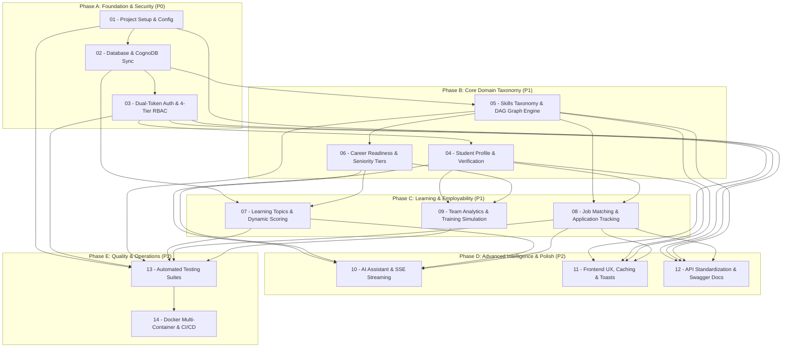

# SkillGraph Implementation Plan: Master Index & Architecture Guide

## Overview
This documentation suite forms **Phase 4 (Module-Wise Implementation Plan)** of the SkillGraph engineering process. It translates the gaps, architectural findings, and requirements documented in `docs/01-SRS/`, `docs/02-Context/`, and `docs/03-Gap-Analysis/` into a sequenced, non-breaking implementation blueprint.

SkillGraph is an existing codebase with active frontend views, backend controllers, MongoDB schemas, and CognoDB (Neo4j) graph integrations. The plan below ensures that every upgrade fits the existing architecture, avoids reinventing working logic, and maximizes technical rigor and portfolio value.

---

## Documentation Suite Index

| Module # | Document Name | Scope & Core Responsibility |
| :---: | :--- | :--- |
| **00** | [00-implementation-plan.md](./00-implementation-plan.md) | Master architectural strategy, execution phases, and rollback principles. |
| **01** | [01-project-setup.md](./01-project-setup.md) | Runtime packages (`cookie-parser`, `express-mongo-sanitize`, `@google/genai`), config schema. |
| **02** | [02-database-and-cognodb.md](./02-database-and-cognodb.md) | New Mongoose schemas (`Topic`, `AuthToken`, `JobApplication`, `ChatMessage`), real-time Neo4j sync. |
| **03** | [03-authentication-and-rbac.md](./03-authentication-and-rbac.md) | Dual-token auth (15m access + 7d refresh), password reset flow, and 4-tier RBAC (`student` role). |
| **04** | [04-student-profile.md](./04-student-profile.md) | Student academic identity, skill proof submission (`proofUrl`), and manager verification workflow. |
| **05** | [05-skills-and-skill-graph.md](./05-skills-and-skill-graph.md) | DAG cycle detection on prerequisite edges, real-time graph mutations, canvas physics sleep. |
| **06** | [06-career-readiness.md](./06-career-readiness.md) | Seniority-tiered roles (`junior`, `mid`, `senior`), calibrated expected proficiencies, explorer filters. |
| **07** | [07-learning-and-recommendations.md](./07-learning-and-recommendations.md) | Dynamic database `Topic` entities, dynamic scoring denominator, course proof submission. |
| **08** | [08-job-matching.md](./08-job-matching.md) | Proficiency-weighted job matching, structured salary queries, in-app application tracking. |
| **09** | [09-team-analysis.md](./09-team-analysis.md) | Department/cohort filtering (`?department=...`), interactive "What-If" training simulation. |
| **10** | [10-ai-assistant.md](./10-ai-assistant.md) | Official `@google/genai` SDK, Server-Sent Events (SSE) token streaming, chat history persistence. |
| **11** | [11-frontend-and-ux.md](./11-frontend-and-ux.md) | Accessible toasts (`react-hot-toast`), in-memory GET caching, card loading skeletons. |
| **12** | [12-api-and-validation.md](./12-api-and-validation.md) | Declarative validation middleware, standardized pagination envelope, Swagger UI (`/api/docs`). |
| **13** | [13-testing.md](./13-testing.md) | Comprehensive automated test suites (math unit tests, DAG tests, integration tests, Vitest UI tests). |
| **14** | [14-deployment-and-devops.md](./14-deployment-and-devops.md) | Multi-container `docker-compose.yml` (Mongo, Neo4j, Backend, Frontend) and GitHub Actions CI. |

---

## Overall Implementation Sequence

The upgrade roadmap is organized into **5 sequential phases** to prevent broken dependencies and minimize risk:

---

## Implementation Priority Matrix

| Priority | Modules | Rationale & Critical Value |
| :--- | :--- | :--- |
| **Critical (P0)** | **01, 02, 03** | **Foundational Architecture**: Upgrades dependencies, creates new schemas (`Topic`, `AuthToken`, `JobApplication`, `ChatMessage`), implements dual-token auth, and formalizes `'student'` role. All other modules depend on these models and authentication cookies. |
| **High (P1)** | **04, 05, 06, 07, 08** | **Core Domain Rigor**: Implements skill verification proofs, graph DAG cycle detection, seniority-tiered role benchmarks, database-backed learning topics, and proficiency-weighted job matching. Resolves top functional gaps. |
| **Medium (P2)** | **09, 10, 11, 12** | **Intelligence & Developer Experience**: Adds departmental team simulation, real-time AI token streaming, in-memory frontend caching, declarative validation middleware, and interactive OpenAPI documentation. |
| **Supporting (P2)**| **13, 14** | **Engineering Excellence**: Establishes multi-layer automated test suites (unit, integration, frontend) and one-command Docker Compose orchestration with automated GitHub Actions CI/CD. |

---

## Which Modules Must Be Completed First?

### First Execution Block: Module 01 $\to$ Module 02 $\to$ Module 03

1. **Why Module 01 (Project Setup) Must Be First**:
   - Installs critical production packages (`cookie-parser`, `express-mongo-sanitize`, `@google/genai`, `swagger-ui-express`, `react-hot-toast`).
   - Configures the middleware pipeline and environment schema validation. Without `cookie-parser`, subsequent refresh token cookies cannot be parsed.

2. **Why Module 02 (Database & CognoDB) Must Be Second**:
   - Defines the new Mongoose schemas (`Topic`, `AuthToken`, `JobApplication`, `ChatMessage`, `AuditLog`) and updates existing models (`User`, `UserSkill`, `Job`, `Role`).
   - Downstream modules (Auth, Learning, Jobs, AI) directly query and instantiate these schemas. Attempting to implement features before schemas exist will cause runtime `SchemaNotRegistered` errors.

3. **Why Module 03 (Authentication & RBAC) Must Be Third**:
   - Formalizes the `'student'` role in `User.accountRole` and implements dual-token session management.
   - All subsequent functional endpoints (skill verification, course enrollments, job applications, AI coach) verify caller identity and role authorization.

---

## Detailed Inter-Module Dependency Analysis

- **Module 04 (Student Profile)** depends on:
  - `Module 02` (for `UserSkill` verification fields and `savedRoleIds`).
  - `Module 03` (for authenticated student caller context).
- **Module 05 (Skills & Skill Graph)** depends on:
  - `Module 02` (for real-time Neo4j sync helper methods).
- **Module 06 (Career Readiness)** depends on:
  - `Module 02` (for `Role.level` attribute).
  - `Module 05` (for prerequisite graph traversal).
- **Module 07 (Learning & Recommendations)** depends on:
  - `Module 02` (for `Topic` collection).
  - `Module 05` (for prerequisite tree traversal).
  - `Module 06` (for role benchmarks and importance weights).
- **Module 08 (Job Matching)** depends on:
  - `Module 02` (for `JobApplication` collection and numeric salary fields).
  - `Module 04` (for student `UserSkill` proficiencies).
- **Module 09 (Team Analysis)** depends on:
  - `Module 03` (restricted to `manager` and `admin`).
  - `Module 04` (aggregates student competencies and departmental attributes).
  - `Module 06` (evaluates against role requirement benchmarks).
- **Module 10 (AI Assistant)** depends on:
  - `Module 01` (for `@google/genai` SDK).
  - `Module 02` (for `ChatMessage` persistent storage).
  - `Module 04, 06, 07, 08` (grounding prompt queries live state across all four domains).
- **Module 11 (Frontend UX)** depends on:
  - `Module 01` (for `react-hot-toast`).
  - Integrates with all page views.
- **Module 12 (API Standardization)** depends on:
  - `Module 01` (for `swagger-ui-express`).
  - Standardizes controllers across all modules.
- **Module 13 (Testing)** validates all logic across Modules 01–12.
- **Module 14 (Deployment & DevOps)** containerizes all completed artifacts from Modules 01–13.

---

## Testing Checkpoints

To ensure zero regressions, testing must be executed at **5 mandatory checkpoints**:

### Checkpoint 1 (Post-Phase A: Foundation Verification)
- Run `Backend/tests/auth.test.js`.
- Verify user registration with `'student'` role succeeds.
- Verify login returns 15m access token and sets HTTP-only `skillgraph_rf` cookie.
- Verify `/api/auth/refresh` rotates token cleanly.

### Checkpoint 2 (Post-Phase B: Taxonomy & Graph Integrity)
- Run `Backend/tests/graphValidation.test.js` and `careerReadiness.test.js`.
- Verify circular prerequisite creation (A $\to$ B $\to$ A) is rejected with 400 Cyclic Dependency error.
- Verify student submitting skill proof link updates status to `pending`, and manager approval sets `verified: true`.
- Verify Junior role evaluation produces higher readiness score than Senior role for baseline proficiencies.

### Checkpoint 3 (Post-Phase C: Dynamic Topics & Employability)
- Run `Backend/tests/learningTopics.test.js` and `jobMatching.test.js`.
- Verify topics load from MongoDB without hardcoded arrays in client or scoring dictionaries.
- Verify student with level 1 proficiency receives 50% partial credit on job match rather than 100%.
- Verify in-app job application saves to `JobApplication` collection and prevents duplicate submissions.

### Checkpoint 4 (Post-Phase D: Streaming AI & Documentation)
- Run `Backend/tests/aiAssistant.test.js` and `validation.test.js`.
- Verify `/api/ai/chat/stream` emits valid Server-Sent Events (SSE) chunks ending in `data: [DONE]`.
- Verify chat history persists across requests in the `ChatMessage` collection.
- Verify Swagger UI loads at `http://localhost:5000/api/docs` and documents all routes.

### Checkpoint 5 (Post-Phase E: Full Stack & CI/CD Verification)
- Run `npm test` across Backend (all unit/integration tests) and Frontend (Vitest component tests).
- Execute `docker compose up --build` and verify all 4 containers boot into healthy states.
- Verify GitHub Actions CI workflow runs green on pull request.

---

## Final Completion Checklist

Use this checklist during future implementation phases to verify complete execution:

- [ ] **Module 01: Project Setup**
  - [ ] Production dependencies installed in `Backend/` and `Frontend/`.
  - [ ] `validateConfig()` active in `config.js`.
  - [ ] Cookie parser and Mongo sanitizer mounted in `app.js`.
  - [ ] `<Toaster />` mounted in `App.jsx`.
- [ ] **Module 02: Database & CognoDB**
  - [ ] 5 new models created (`Topic`, `AuthToken`, `JobApplication`, `ChatMessage`, `AuditLog`).
  - [ ] Existing schemas updated (`User`, `UserSkill`, `Job`, `Role`, `LearningProgress`).
  - [ ] Real-time Cypher mutation helpers active in `graphService.js`.
  - [ ] Seed catalog updated with database topics.
- [ ] **Module 03: Authentication & RBAC**
  - [ ] Dual-token auth issuing 15m access token + HTTP-only refresh cookie.
  - [ ] `/api/auth/refresh` silent refresh interceptor working in frontend.
  - [ ] Password reset flow working (`forgot-password` and `reset-password/:token`).
  - [ ] `'student'` role selectable on registration and guarded in routes.
- [ ] **Module 04: Student Profile**
  - [ ] Skill verification submission endpoint (`/my-skills/:skillId/verify`).
  - [ ] Manager review endpoints (`/verifications/pending`, `/review`).
  - [ ] Verification badges rendered in `MySkills.jsx` and `Profile.jsx`.
- [ ] **Module 05: Skills & Skill Graph**
  - [ ] DAG cycle detection active on prerequisite relationships.
  - [ ] Real-time Neo4j synchronization on skill mutations.
  - [ ] Physics simulation sleep implemented in `SkillGraph.jsx`.
- [ ] **Module 06: Career Readiness**
  - [ ] Role seniority tiers (`junior`, `mid`, `senior`) supported.
  - [ ] Seniority filter tabs active on `CareerExplorer.jsx`.
  - [ ] Tiered benchmark guidance displayed in `SkillGaps.jsx`.
- [ ] **Module 07: Learning & Recommendations**
  - [ ] Hardcoded topic arrays removed from `scoring.js` and `Progress.jsx`.
  - [ ] Dynamic topic endpoints `/api/learning/topics/catalog` active.
  - [ ] Course completion proof URL supported in `LearningProgress`.
- [ ] **Module 08: Job Matching**
  - [ ] Proficiency-weighted matching formula active in `jobService.js`.
  - [ ] Numeric salary range queries supported (`salaryMin`, `salaryMax`).
  - [ ] In-app job application workflow and "My Applications" tab active in `Jobs.jsx`.
  - [ ] `CareerMarket.jsx` connected to real `/api/jobs/analytics` aggregation pipeline.
- [ ] **Module 09: Team Analysis**
  - [ ] Department and cohort query filters supported on all team endpoints.
  - [ ] "What-If" training simulation endpoint (`POST /api/team/simulate`) active.
  - [ ] Interactive simulation panel implemented in `TeamAnalysis.jsx`.
- [ ] **Module 10: AI Assistant**
  - [ ] Official Google Gen AI SDK integrated.
  - [ ] Server-Sent Events (SSE) streaming active on `/api/ai/chat/stream`.
  - [ ] Word-by-word streaming typewriter UI rendered in `AIAssistant.jsx`.
  - [ ] Chat history persisted in `ChatMessage` collection.
- [ ] **Module 11: Frontend UX**
  - [ ] Native `alert()` calls replaced with `react-hot-toast`.
  - [ ] In-memory GET request caching active in `api.js`.
  - [ ] Reusable `LoadingSkeleton.jsx` integrated on dashboard cards.
- [ ] **Module 12: API & Validation**
  - [ ] Declarative validation middleware active across route files.
  - [ ] Standardized pagination response structure adopted across all controllers.
  - [ ] Interactive Swagger UI hosted at `/api/docs`.
- [ ] **Module 13: Testing**
  - [ ] Unit tests for scoring math and DAG cycle detection passing.
  - [ ] Integration tests for auth, verifications, and jobs passing.
  - [ ] Vitest component smoke tests passing in frontend.
- [ ] **Module 14: Deployment & DevOps**
  - [ ] `Backend/Dockerfile` and `Frontend/Dockerfile` created.
  - [ ] Root `docker-compose.yml` orchestrating Mongo, Neo4j, Backend, Frontend.
  - [ ] GitHub Actions CI workflow active and passing.
