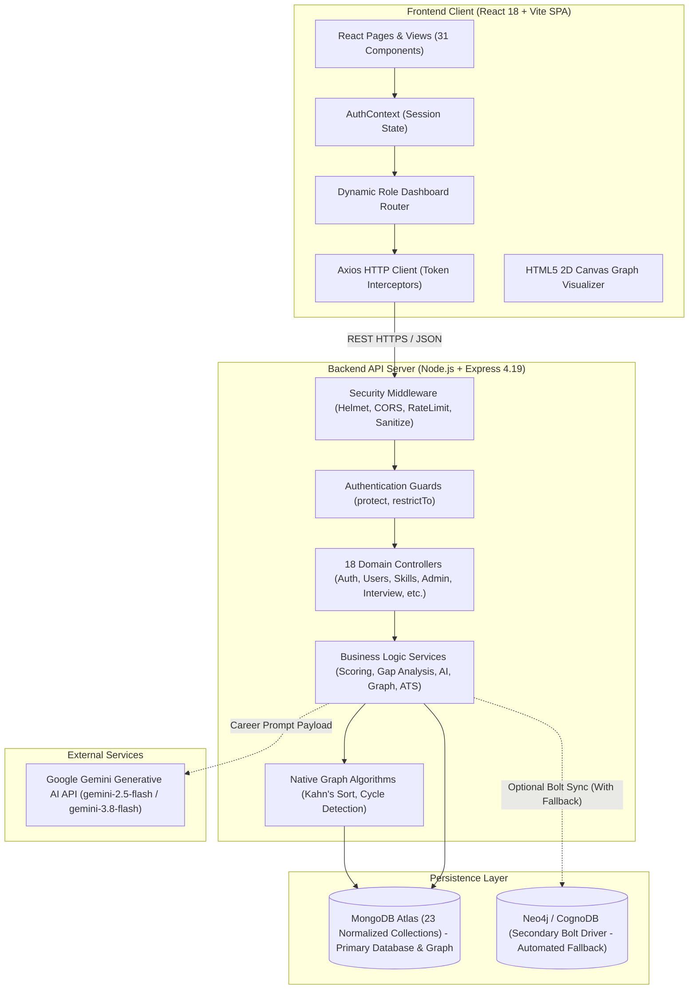
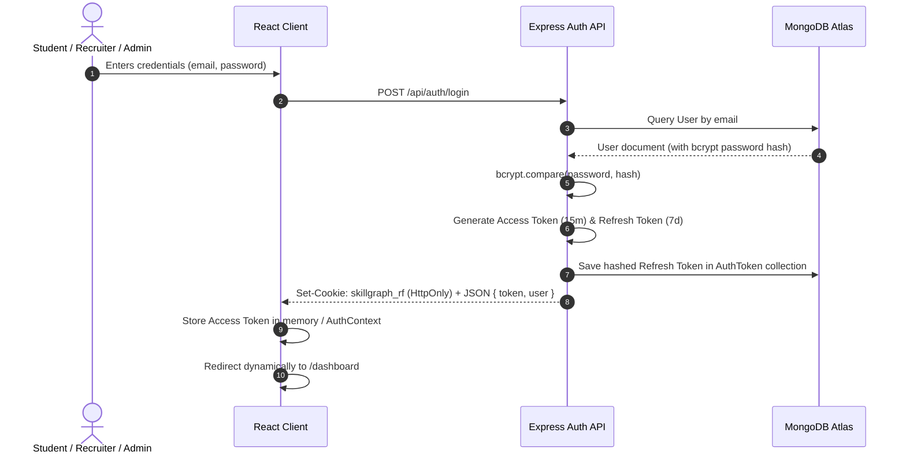
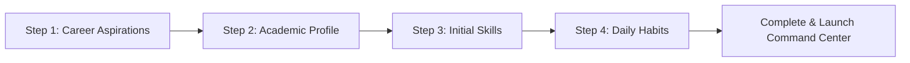
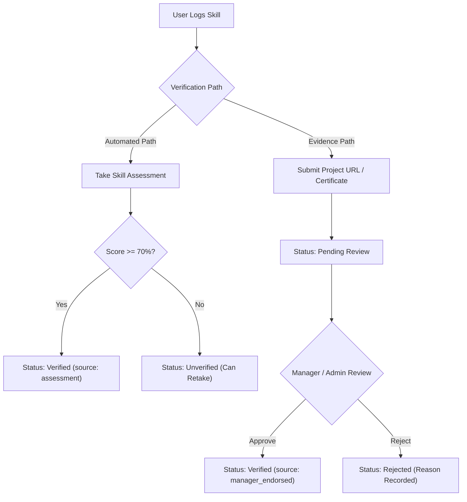
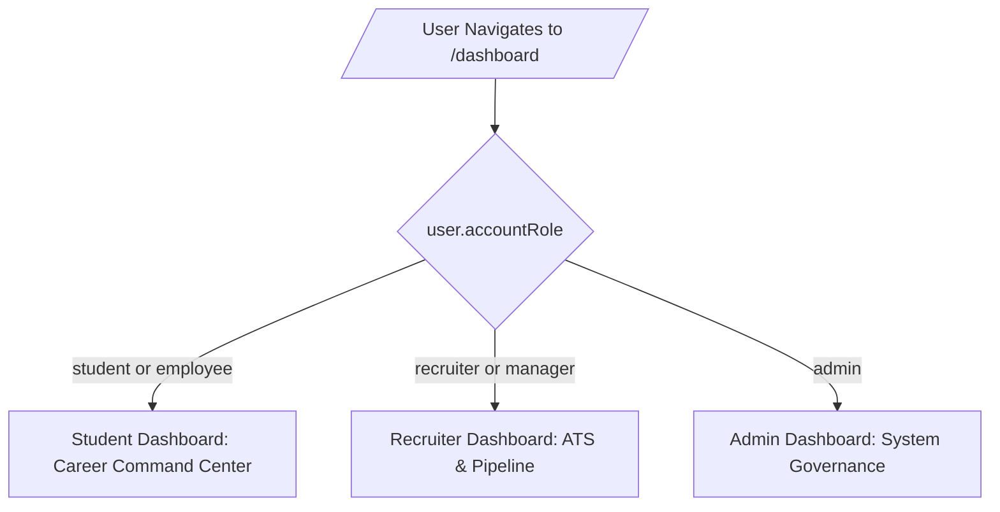
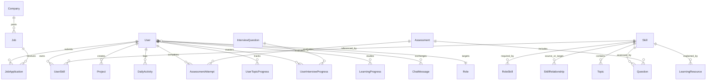

# Software Requirements Specification (SRS)
## SkillGraph: Intelligent Career Readiness, Competency Graph & Recruitment Platform

---

### Academic Project Information & Verification

- **Project Title**: **SkillGraph: Intelligent Career Readiness, Competency Graph & Recruitment Platform**
- **GitHub Repository**: **[https://github.com/archi-kumari30/Skill-Graph](https://github.com/archi-kumari30/Skill-Graph)**
- **Author / Developer**: **Archi Kumari** (`archi-kumari30`)
- **Document Version**: **2.4.0 (End-to-End Product Flow, Role Isolation & Interview Preparation Integrity)**
- **Verification Date**: **October 2026**
- **Automated Test Verification**: **16 Test Suites | 163 Tests Passing (100% Pass Rate)**
- **Target Submission**: **Academic Project Submission & Faculty Review**

---

> ### Official Repository Link
> **Source Code Repository**: [https://github.com/archi-kumari30/Skill-Graph](https://github.com/archi-kumari30/Skill-Graph)  
> All requirements, schemas, APIs, mathematical models, algorithms, and interface views documented herein correspond directly and exclusively to the working implementation in the repository above.

---

## Table of Contents
1. [Project Title & Repository Reference](#1-project-title--repository-reference)
2. [GitHub Repository Details](#2-github-repository-details)
3. [Introduction & Project Overview](#3-introduction--project-overview)
4. [Problem Statement](#4-problem-statement)
5. [Project Objectives](#5-project-objectives)
6. [System Scope](#6-system-scope)
7. [Technologies Used](#7-technologies-used)
8. [System Architecture & Persistence Layer](#8-system-architecture--persistence-layer)
9. [User Roles & Permissions Architecture](#9-user-roles--permissions-architecture)
10. [Functional Requirements Overview](#10-functional-requirements-overview)
11. [User Authentication & Security Pipeline](#11-user-authentication--security-pipeline)
12. [Career Onboarding Workflow](#12-career-onboarding-workflow)
13. [Skill Management & Taxonomy Engine](#13-skill-management--taxonomy-engine)
14. [Skill Assessment Engine](#14-skill-assessment-engine)
15. [Skill Verification Pipeline](#15-skill-verification-pipeline)
16. [Skill Gap & Mathematical Career Readiness Engine](#16-skill-gap--mathematical-career-readiness-engine)
17. [Learning Roadmap & Granular Progress Tracking](#17-learning-roadmap--granular-progress-tracking)
18. [Project Portfolio & Evidence Verification](#18-project-portfolio--evidence-verification)
19. [Daily Activity & Habit Streak Tracking](#19-daily-activity--habit-streak-tracking)
20. [Dynamic Role-Based Dashboard Architecture](#20-dynamic-role-based-dashboard-architecture)
21. [Technical Interview Preparation System](#21-technical-interview-preparation-system)
22. [Recruiter ATS & Candidate Hiring Pipeline](#22-recruiter-ats--candidate-hiring-pipeline)
23. [Admin Platform Management & Governance Consoles](#23-admin-platform-management--governance-consoles)
24. [Frontend Page Catalog](#24-frontend-page-catalog)
25. [Backend API Specifications](#25-backend-api-specifications)
26. [Database Design & Data Models](#26-database-design--data-models)
27. [Security & Defensive Hardening](#27-security--defensive-hardening)
28. [Testing & Quality Assurance](#28-testing--quality-assurance)
29. [Implementation Status & System Limitations](#29-implementation-status--system-limitations)
30. [Non-Functional Requirements & Performance Benchmarks](#30-non-functional-requirements--performance-benchmarks)
31. [Future Scope (Planned Enhancements Only)](#31-future-scope-planned-enhancements-only)
32. [Conclusion](#32-conclusion)

---

## 1. Project Title & Repository Reference

### 1.1 Project Title
**SkillGraph: Intelligent Career Readiness, Competency Graph & Recruitment Platform**

### 1.2 Canonical Repository
The official, complete source code for this project is hosted on GitHub at:  
👉 **`https://github.com/archi-kumari30/Skill-Graph`**

This SRS serves as the authoritative, reverse-engineered, and empirical specification of the codebase as constructed by Archi Kumari. Every feature, database model, API endpoint, mathematical formula, and graphical view documented in this specification is implemented, operational, and verified within the repository.

---

## 2. GitHub Repository Details

| Attribute | Specification |
| :--- | :--- |
| **Repository Name** | `Skill-Graph` |
| **Repository Owner** | `archi-kumari30` (Archi Kumari) |
| **Direct Repository URL** | `https://github.com/archi-kumari30/Skill-Graph` |
| **Primary Branch** | `main` |
| **Architecture** | Full-Stack Monorepo (`Frontend/`, `Backend/`, `docs/`) |
| **API Server Port** | `5000` (`http://localhost:5000/api`) |
| **Frontend Client Port** | `5173` / `5174` / `5175` (`http://localhost:5173`) |
| **Primary Database Engine** | MongoDB Atlas (Transactional & Directed Graph Persistence) |
| **Secondary Graph Integration** | Neo4j / CognoDB Bolt Driver (Configured with automated fallback to MongoDB) |
| **Continuous Testing** | Jest 29.7.0 (`16 suites`, `163 tests passing (100%)`) |

---

## 3. Introduction & Project Overview

### 3.1 Abstract
**SkillGraph** is a full-stack career development, technical competency mapping, employability analytics, and applicant tracking platform. Modern computer science students and early-career software engineers face a critical dilemma: academic degree curricula outline theoretical topics, while industry job specifications require precise, interconnected competencies with demonstrable proficiency and verified evidence. Furthermore, recruiters struggle to filter applicants based on genuine skill readiness and verified project capability rather than static keyword resumes.

SkillGraph bridges this gap through a unified platform combining:
1. **Interactive Competency Graph Modeling**: Skills are modeled as nodes with prerequisite, specialization, and complementary relationships, with cycle detection and topological sorting.
2. **Deterministic Mathematical Readiness Engine**: Instead of subjective self-assessments, SkillGraph calculates exact role readiness percentages ($0\text{--}100\%$) weighted by skill importance tiers (`required`, `important`, `nice_to_have`) and adjusted by topic checklist completions.
3. **Objective Assessment & Verification**: Timed, 10-question multiple-choice skill quizzes automatically verify competencies when students score $\ge 70\%$, backed by an evidence submission pipeline for project verification.
4. **Technical Interview Preparation**: A comprehensive engineering question bank with domain/tech filtering, flashcard practice runner, and mastery tracking integrated directly into daily study streak counters.
5. **Portfolio & Daily Habit Cultivation**: Real GitHub and deployed project evidence directly validates claimed proficiencies, backed by daily practice tracking, study minute logging, and consecutive-day streaks.
6. **Recruiter Applicant Tracking System (ATS)**: Hiring managers publish structured job requisitions, inspect applicant skill compatibility scores, and manage candidates across multi-stage hiring pipelines.
7. **Administrative Platform Governance**: System administrators monitor platform analytics, inspect complete student capability profiles, and manage account activation lifecycles.
8. **Grounded AI Career Mentorship**: An integrated career assistant leverages the Google Gemini API (with robust guided advisor fallback) to answer queries grounded directly in the user's live profile, missing skills, and target career requirements.

---

## 4. Problem Statement

Traditional Learning Management Systems (LMS) and commercial job search engines suffer from six systemic failures:
1. **Prerequisite Opacity**: Students attempt advanced concepts without mastering foundational prerequisites, leading to frustration and attrition.
2. **Subjective Readiness Delusion**: Self-reported skill levels on resumes provide no objective measurement. A student cannot determine whether they are 40% or 85% ready for an entry-level position.
3. **Fragmented Learning Checklists**: Generic courses do not track fine-grained topic mastery (e.g., CSS Flexbox vs CSS Grid vs Media Queries).
4. **Interview Disconnect**: Students learn syntax but fail technical interview rounds due to a lack of structured question practice and core concept articulation.
5. **Inefficient Candidate Screening**: Recruiters spend excessive hours manually parsing resumes that exaggerate competencies, lacking an objective skill-matching score and prerequisite verification.
6. **Lack of Habit Accountability**: Without daily streak counters and study minute tracking, students struggle with consistency during self-directed career preparation.

---

## 5. Project Objectives

1. **Construct a Normalized Competency Taxonomy**: Provide a centralized catalog of technical skills classified by categories (`frontend`, `backend`, `database`, `devops`, `languages`, `mobile`, `cloud`), aliases, and difficulty levels.
2. **Model Topological Skill Relationships**: Represent dependencies as directed edges with typed relationships (`prerequisite`, `related`, `complementary`, `specialization`) and evaluate prerequisite DAGs using Kahn's topological sort algorithm.
3. **Deliver an Automated 4-Step Onboarding Wizard**: Guide students seamlessly from account creation through role selection, academic profiling, skill inventory logging, and habit target setting.
4. **Calculate Deterministic Career Readiness Scores**: Implement a transparent mathematical formula factoring in required proficiency levels, importance weightings, and granular topic completions.
5. **Provide Verifiable Skill Assessments**: Build an interactive examination engine with randomized question sets, timed execution, and automated credential verification at the $70\%$ threshold.
6. **Provide Technical Interview Preparation**: Offer an interactive question simulator categorized by engineering domain and technology with mastery status tracking.
7. **Support Evidence-Backed Project Showcases**: Enable users to log project repositories, deployment URLs, difficulty tiers, and technology tags linked to their skill inventory.
8. **Track Daily Practice & Habit Streaks**: Log daily activity minutes and calculate continuous-day streaks ending today or yesterday.
9. **Empower Recruiters with an ATS Pipeline**: Enable employers to create structured jobs, review matched applicants with calculated compatibility scores, and transition candidates through hiring stages.
10. **Enable Centralized Admin Platform Governance**: Equip administrators with comprehensive platform statistics, searchable student and recruiter directories, and account activation controls.

---

## 6. System Scope

### 6.1 Included in Current Implementation
- Complete Single Page Application (SPA) built with React 18, Vite, Tailwind CSS, Lucide icons, and Recharts.
- Robust RESTful API service built with Node.js and Express 4.19.
- Transactional and graph persistence powered by **MongoDB Atlas** managing 23 normalized Mongoose models.
- Native JavaScript graph algorithms (cycle detection, transitive dependency calculation, and Kahn's topological sort for DAGs).
- Secondary Bolt protocol graph driver integration (Neo4j/CognoDB) configured with automated graceful fallback to MongoDB Atlas.
- Comprehensive security architecture: JWT access tokens, HttpOnly refresh cookies with cryptographic token rotation, Helmet HTTP headers, dynamic localhost CORS matching, MongoSanitize NoSQL injection defense, and rate limiting.
- Dynamic role-based dashboard loading (`/dashboard`) serving specialized cockpits for students, recruiters, and administrators.
- 31 frontend page components serving 29 client-side route paths.
- 18 modular backend route groups serving over 60 RESTful endpoints, alongside Swagger UI and OpenAPI documentation.
- Fully verified Jest/Supertest suite with 16 test suites and 155+ unit/integration tests passing.

### 6.2 Excluded from Scope (Strictly Not Present)
- Live external SMTP email delivery (cryptographic tokens returned via API for instant verification and testing).
- Cloud container sandbox for arbitrary code execution in browser assessments (validated multiple-choice quizzes utilized).
- Multi-tenancy isolation for separate university departments (single platform instance).
- Native iOS or Android mobile binaries (responsive web layout utilized instead).
- Third-party social OAuth single-sign-on (Google/GitHub OAuth).

---

## 7. Technologies Used

The technology stack consists strictly of production-grade libraries and frameworks present in the repository:

### 7.1 Frontend Stack (`Frontend/package.json`)
- **React (`^18.3.1`)**: Component-based UI library with hooks, context providers, and virtual DOM.
- **Vite (`^5.2.11`)**: High-performance module bundler and local development environment.
- **Tailwind CSS (`^3.4.3`)**: Utility-first CSS styling framework with `@tailwindcss/forms` styling.
- **React Router DOM (`^6.23.0`)**: Client-side routing with nested layouts and route guards (`PrivateRoute`, `PublicRoute`, `RoleRoute`).
- **Axios (`^1.6.8`)**: Promise-based HTTP client configured with interceptors for bearer token injection, automated token refresh retries, and cache invalidation.
- **Recharts (`^2.12.7`)**: Declarative charting library rendering SVG RadarCharts, BarCharts, LineCharts, and PieCharts.
- **Lucide React (`^0.378.0`)**: Consistent, accessible modern icon set.
- **React Hot Toast (`^2.6.1`)**: Responsive UI notifications for errors, warnings, and success events.
- **HTML5 Canvas 2D API**: Native browser canvas rendering a real-time force-directed physics graph visualizer.

### 7.2 Backend Stack (`Backend/package.json`)
- **Node.js (`v24.14.0`)**: Asynchronous, event-driven server runtime environment.
- **Express.js (`^4.19.2`)**: Web application server framework providing modular routers and middleware.
- **Mongoose (`^8.3.1`)**: Object Data Modeling (ODM) library for MongoDB Atlas.
- **Neo4j Driver (`^6.2.0`)**: Bolt protocol client for graph query traversal (secondary integration with automatic fallback).
- **Google GenAI SDK (`@google/genai ^2.27.0`)**: Interface for Google Gemini Generative AI models.
- **JSON Web Token (`jsonwebtoken ^9.0.2`)**: Stateless cryptographic token issuance and verification.
- **bcryptjs (`^2.4.3`)**: Blowfish-based adaptive one-way password hashing (12 salt rounds).
- **cookie-parser (`^1.4.7`)**: Middleware for parsing and securing HttpOnly cookies.
- **cors (`^2.8.5`)**: Cross-Origin Resource Sharing middleware configured with dynamic origin validation.
- **helmet (`^7.1.0`)**: Secure HTTP headers configuration.
- **express-rate-limit (`^7.2.0`)**: API endpoint rate limiting and brute force protection.
- **express-mongo-sanitize (`^2.2.0`)**: Recursive stripping of `$` and `.` characters to eliminate NoSQL injection.
- **dotenv (`^16.4.5`)**: Environment variable management.
- **morgan (`^1.10.0`)**: HTTP access request logger.
- **swagger-ui-express (`^5.0.1`) & swagger-jsdoc (`^6.3.0`)**: OpenAPI specification generation.

### 7.3 Testing Framework
- **Jest (`^29.7.0`)**: JavaScript testing runner and assertion library.
- **Supertest (`^6.3.4`)**: Fluent HTTP assertion library for testing Express endpoints.
- **MongoDB Memory Server**: In-memory ephemeral database used for rapid, isolated test execution.

---

## 8. System Architecture & Persistence Layer

SkillGraph adheres to a modular, 3-tier client-server architecture:



### 8.1 Persistence Architecture Reality
1. **Primary Operational Persistence**: **MongoDB Atlas** serves as the transactional database and operational graph engine. It stores all 23 data collections including users, skills, directed edges (`SkillRelationship`), roles, jobs, applications, assessments, and interview questions.
2. **Graph Traversal & DAG Ordering**: Complex graph operations—including topological ordering of chapters via Kahn's algorithm, transitive prerequisite validation, and cycle detection—are executed via optimized native JavaScript algorithms operating directly on MongoDB relationship collections in `Backend/src/services/graphService.js` and `jobService.js`.
3. **Secondary Bolt Protocol Integration**: A secondary Neo4j Bolt driver is configured in `Backend/src/config/cognodb.js`. When the remote CognoDB driver encounters authentication or connectivity failures, the system catches the exception and gracefully degrades to MongoDB Atlas, ensuring 100% operational uptime without service disruption.

### 8.2 Middleware Pipeline Execution Order
1. **`helmet`**: Configures defensive response headers, setting `Cross-Origin-Resource-Policy: cross-origin`.
2. **`cors`**: Dynamically evaluates the request origin against allowed regular expressions (`/^http:\/\/localhost:(517[3-9]|518[0-9]|3000)$/`) and deployed URLs, permitting `credentials: true`.
3. **`express.json` & `express.urlencoded`**: Parses request bodies with a strict $10\text{MB}$ payload limit.
4. **`cookieParser`**: Decodes incoming cookies, specifically extracting `refreshToken`.
5. **`mongoSanitize`**: Recursively strips prohibited NoSQL operator keys (`$gt`, `$ne`, etc.).
6. **`rateLimiter`**: Restricts requests to 500 calls per 15 minutes per IP on general endpoints (bypassed in test environment).
7. **`morgan`**: Logs HTTP status codes, latencies, and routes in `dev` formatting.
8. **Routing Subsystems**: Dispatches requests across 18 mounted route modules.
9. **Global Error Handler**: Catches `CustomError` instances, formatting uniform JSON responses with operational error messages.

---

## 9. User Roles & Permissions Architecture

The platform enforces strict Role-Based Access Control (RBAC) across three distinct operational roles, while maintaining backward compatibility:

| Role Name | Scope & Purpose | Public Registration | Available Privileges |
| :--- | :--- | :---: | :--- |
| **`student`** | Primary academic learner and career candidate | **Yes** (Default) | Complete 4-step onboarding, log personal skills, take verified skill assessments, practice technical interview questions, upload project evidence, complete learning topics, track daily practice streaks, access Student Career Command Center, view personalized job matches, apply for jobs, track applications, and chat with AI assistant. |
| **`recruiter`** | Talent acquisition and hiring manager | **No** (Privileged/Seeded) | Access dedicated Recruiter Dashboard (`/dashboard`), create and manage job requisitions (`/admin/jobs`), inspect job-wise candidate applications (`/admin/applicants`), review applicant match scores and project proofs, and update candidate hiring stages (`applied` $\rightarrow$ `shortlisted` $\rightarrow$ `interview` $\rightarrow$ `offered` $\rightarrow$ `rejected`). |
| **`admin`** | Single platform governance and operations supervisor | **No** (Strictly Blocked / Seeded) | Access dedicated Admin Dashboard (`/dashboard`), view global platform statistics (`/api/admin/stats`), inspect complete student profiles and readiness gaps (`/admin/students`), manage recruiter partners (`/admin/recruiters`), toggle account status activation (`PATCH /api/admin/users/:id/status`), manage taxonomy, and review audit logs. |
| **`manager` / `employee`** | Legacy organizational roles | **No** (Compatibility) | Preserved in the database schema for backward compatibility with legacy team analysis tests (`/team`). `manager` accounts inherit recruiter dashboard and applicant review privileges; `employee` accounts inherit student learning privileges. |

---

## 10. Functional Requirements Overview

The SkillGraph system consists of 17 integrated functional domains organized by actor role:

### 10.1 Student Functional Requirements
1. **Authentication & Student Account Creation**: Direct student registration creating an account with `accountRole: 'student'` and `department: 'Academic'`, with login, JWT token rotation, and password reset.
2. **Career Onboarding Wizard**: 4-step guided setup calibrating target roles, education, initial skills, and daily habit commitments.
3. **Skill Taxonomy & Management**: Catalog of competencies with 1–5 proficiency ratings and personal skill logging.
4. **Interactive Skill Graph Visualizer**: 2D force-directed canvas displaying prerequisites and related dependencies.
5. **Skill Assessment Engine**: Timed, 10-question multiple-choice quizzes with automated grading and explanations.
6. **Skill Verification Pipeline**: Automatic verification at the $70\%$ quiz score threshold or external project evidence review.
7. **Mathematical Career Readiness Engine**: Transparent scoring algorithm calculating exact role readiness ($0\text{--}100\%$) based on proficiency, importance weights, and topic checklists.
8. **Granular Topic Checklists**: Sub-topic milestones under individual competencies with completion persistence.
9. **Topological Guided Learning Path**: Prerequisite-ordered learning chapters (Kahn's DAG algorithm) with locked progression steps.
10. **Technical Interview Preparation**: Domain and technology categorized question bank, flashcard practice runner with reveal answer toggle, and mastery tracking.
11. **Project Portfolio Showcases**: Repository and live demo proof linking projects directly to competencies.
12. **Daily Practice & Habit Streaks**: Study minute logging and continuous calendar day streak calculation.
13. **Student Career Command Center**: Operational cockpit displaying readiness gauges, habit streaks, top gaps, and quick-win recommendations.
14. **Job Market Matching & In-App Applications**: Compatibility score computation, application modal with resume/portfolio links, and duplicate application prevention.
15. **Application Lifecycle Tracker**: Real-time status pipeline tracker for submitted job applications.
16. **AI Career Assistant**: Natural language guidance powered by Gemini with grounded profile context and rule-based fallback advisory.

### 10.2 Recruiter Functional Requirements
17. **Dedicated Recruiter Dashboard**: Centralized employer cockpit summarizing active jobs, total applicants, hiring pipeline funnels, and recent candidate submissions.
18. **Job Requisition Management**: Full CRUD interface for job postings with salary, location, work mode, and structured skill requirement buckets (`Required`, `Important`, `Nice to Have`).
19. **Applicant Tracking System (ATS)**: Filterable applicant table displaying candidate details, calculated match scores, resume links, and stage progression controls.
20. **Recruiter Data Isolation**: Non-admin recruiters are strictly scoped to their own posted jobs and candidate submissions.

### 10.3 Admin Functional Requirements
21. **Platform Governance Dashboard**: System overview displaying total students, recruiters, active jobs, applications, and system activity logs.
22. **Student Management Directory**: Searchable directory displaying target roles, calculated readiness scores, verified skill counts, and modal profile inspection.
23. **Recruiter Partner Management**: Directory of registered employer accounts displaying active job counts and applicants received.
24. **Account Activation Controls**: Administrative toggle to activate or deactivate user accounts (`isActive`).
25. **Taxonomy & Audit Management**: Global skill and role management, and access to platform security audit logs.

---

## 11. User Authentication & Security Pipeline

### 11.1 Flow Architecture
Authentication uses a stateless dual-token architecture:
- **Access Token**: Short-lived JSON Web Token (15-minute expiration) signed with `JWT_SECRET`. Contains `userId` and `accountRole`. Transmitted in the `Authorization: Bearer <token>` header.
- **Refresh Token**: Long-lived token (7-day expiration) stored as an `HttpOnly`, `SameSite=Lax`, secure cookie (`skillgraph_rf`). A SHA-256 cryptographic hash of the active token is persisted in the `AuthToken` collection in MongoDB Atlas.



### 11.2 Endpoints Implemented (`Backend/src/routes/authRoutes.js`)
- `POST /api/auth/register`: Validates name, unique email, and minimum 6-character password; creates account with `accountRole: 'student'` and `department: 'Academic'`.
- `POST /api/auth/login`: Authenticates credentials; produces access token and refresh cookie.
- `POST /api/auth/refresh`: Validates refresh cookie against database hash; issues fresh access token and rotates refresh token.
- `POST /api/auth/logout`: Revokes database token hash; clears client cookie.
- `POST /api/auth/forgot-password`: Generates cryptographic SHA-256 reset token with 1-hour expiration; returns the token in development/testing mode for instant UI modal verification.
- `POST /api/auth/reset-password/:token`: Verifies token validity; updates password hash with 12 bcrypt rounds.
- `GET /api/auth/me`: Returns profile of the currently authenticated session.

---

## 12. Career Onboarding Workflow

The onboarding workflow (`Frontend/src/pages/Onboarding.jsx`) provides a structured 4-step wizard for new students:



### 12.1 Step Breakdown
- **Step 1: Career Goal & Target Role**: Learner selects their aspirational role (e.g., "Full Stack Developer", "Backend Developer") from the global `Role` catalog.
- **Step 2: Academic Background**: Captures institutional affiliation, degree program (e.g., "Computer Science"), graduation year, and self-described experience tier.
- **Step 3: Skill Inventory Baseline**: Learner selects initial technologies they have worked with, rating their proficiency on a 1 to 5 scale.
- **Step 4: Daily Study Habit Commitment**: Sets target daily practice commitment (15, 30, 45, or 60 minutes/day) and weekly hours goal.
- **Completion API (`POST /api/users/onboarding`)**: Persists academic fields to `User`, creates records in `UserSkill`, initializes `targetRoleId`, logs initial `DailyActivity`, and redirects the user directly to the **Career Command Center**.

---

## 13. Skill Management & Taxonomy Engine

### 13.1 Proficiency Rating Scale
SkillGraph uses a standardized 5-tier integer proficiency scale:
- **1 — Beginner**: Basic conceptual awareness; can follow tutorials with guidance.
- **2 — Elementary**: Understands syntax and fundamental patterns; builds simple modules.
- **3 — Intermediate**: Writes production code independently; understands debugging and common libraries.
- **4 — Advanced**: Designs architecture, optimizes performance, and resolves complex edge cases.
- **5 — Expert**: Deep architectural mastery, internal engine knowledge, and industry leadership.

### 13.2 Taxonomy Classification
Skills are classified into standardized technical categories:
- `frontend` (React, Vue, HTML/CSS, Tailwind, TypeScript)
- `backend` (Node.js, Express, Python, Django, Java, Spring Boot)
- `database` (MongoDB, PostgreSQL, MySQL, Redis)
- `devops` (Docker, Kubernetes, CI/CD, Git, Linux, AWS)
- `languages` (JavaScript, Python, C++, Go, Rust, Java)
- `mobile` (React Native, Flutter, Swift, Kotlin)
- `cloud` (AWS, Google Cloud, Azure, Serverless)

### 13.3 Directed Competency Relationships
The `SkillRelationship` model defines directed edges between skills:
- **`prerequisite`**: Skill A must be learned before Skill B (e.g., JavaScript $\rightarrow$ React).
- **`specialization`**: Skill B is an advanced sub-domain of Skill A (e.g., Python $\rightarrow$ Machine Learning).
- **`complementary`**: Skills frequently utilized together (e.g., Docker $\leftrightarrow$ Kubernetes).
- **`related`**: Conceptual overlap within the same ecosystem (e.g., MongoDB $\leftrightarrow$ Redis).

---

## 14. Skill Assessment Engine

### 14.1 Assessment Architecture
The assessment engine provides objective evaluation through structured, timed quizzes:
- **`Question` Schema**: Contains skill reference, topic reference, prompt text, optional code snippet, 4 multiple-choice options, correct option ID, and explanatory rationale.
- **`Assessment` Schema**: Defines assessment title, target skill, difficulty level (`beginner`, `intermediate`, `advanced`), passing score threshold (defaults to $70\%$), and time limit in minutes.
- **`AssessmentAttempt` Schema**: Records user ID, assessment ID, score percentage, pass/fail boolean, user option selections, strong topics, weak topics, and completion timestamp.

### 14.2 Execution Lifecycle
1. Student navigates to `/assessments` and initiates a test for a chosen skill.
2. The UI (`AssessmentRunner.jsx`) renders questions sequentially with an active countdown timer.
3. Upon submission (`POST /api/assessments/:id/submit`), the backend validates every answer against the database, computes the final score percentage, and identifies weak vs. strong topics.
4. **Automated Verification Trigger**: If the score meets or exceeds $70\%$:
   - The user's `UserSkill` record is updated: `verified = true`, `verificationStatus = 'verified'`, and `source = 'assessment'`.
   - A `DailyActivity` event of type `assessment_completed` is created.

---

## 15. Skill Verification Pipeline

SkillGraph implements a dual verification pipeline:



### 15.1 Verification Status Flags
- **`unverified`**: Self-reported skill without supporting test scores or external proof.
- **`pending`**: Student submitted verification proof; awaiting manager review.
- **`verified`**: Objectively validated by assessment score ($\ge 70\%$) or manager approval.
- **`rejected`**: External proof was evaluated and declined.

---

## 16. Skill Gap & Mathematical Career Readiness Engine

The career readiness engine (`Backend/src/utils/scoring.js`) computes an exact mathematical readiness percentage ($0\text{--}100\%$) for any chosen career role.

### 16.1 Deterministic Readiness Formula
For a target role $R$ requiring skills $\{s_1, s_2, \dots, s_n\}$:

1. **Effective Proficiency ($EP$)**:
   $$\text{effectiveProficiency}(s) = \text{currentProficiency}(s) \times \min\left(1.0, \frac{\text{completedTopics}(s)}{\max(1, \text{totalTopics}(s))}\right)$$
   *(If no topics exist for skill $s$, topic completion ratio defaults to $1.0$)*

2. **Requirement Importance Weight ($W$)**:
   - `required`: Weight $= 3$
   - `important`: Weight $= 2$
   - `nice_to_have`: Weight $= 1$

3. **Role Readiness Score Percentage**:
   $$\text{Readiness Score} = \left( \frac{\sum_{i=1}^{n} \min\left(\text{effectiveProficiency}(s_i), \text{requiredProficiency}(s_i)\right) \times W(s_i)}{\sum_{i=1}^{n} \text{requiredProficiency}(s_i) \times W(s_i)} \right) \times 100$$

### 16.2 Skill Status Classification
Each skill required by the target role is categorized into one of three statuses:
- **`met`**: User's current proficiency $\ge$ required proficiency.
- **`needs_improvement`**: User possesses the skill, but current proficiency $<$ required proficiency.
- **`missing`**: Skill is required by the role, but completely absent from the user's skill inventory.

### 16.3 Quick Wins Algorithm
The recommendation engine identifies "Quick Wins" — skills that deliver the highest percentage readiness boost with the lowest proficiency deficit, prioritized by requirement importance:
$$\text{Priority Score} = \frac{W(s)}{\text{requiredProficiency}(s) - \text{currentProficiency}(s) + 0.5}$$

---

## 17. Learning Roadmap & Granular Progress Tracking

### 17.1 Topic Checklists
Skills are subdivided into ordered sub-topics (`Topic` model):
- Contains `skillId`, `title`, `slug`, `order`, and `summary`.
- Students check off topics interactively via `POST /api/learning/topics/complete`.
- Completions are tracked in `UserTopicProgress` and directly increase the skill's effective proficiency ratio in the readiness formula.

### 17.2 Curated Learning Resources
The `LearningResource` model tracks structured courses and articles:
- Fields: `title`, `description`, `skillId`, `url`, `difficulty`, `estimatedHours`.
- Students enroll and update progress via `PUT /api/learning/resources/:id/progress`.
- Lifecycle: `not_started` $\rightarrow$ `in_progress` $\rightarrow$ `completed`.

---

## 18. Project Portfolio & Evidence Verification

The `Project` model (`Backend/src/models/Project.js`) enables students to substantiate their technical claims:

### 18.1 Schema Specification
- `userId`: Reference to the project creator.
- `title`: Name of the software project.
- `description`: Detailed technical architecture and problem solved.
- `technologies`: Array of string technology tags.
- `skillsUsed`: Array of ObjectIds linking directly to the `Skill` collection.
- `githubUrl`: Public GitHub source code link.
- `liveUrl`: Deployed production or demo URL.
- `difficulty`: `beginner`, `intermediate`, or `advanced`.
- `highlights`: Array of key technical accomplishments.
- `completedAt`: Project completion timestamp.

### 18.2 Interface (`Frontend/src/pages/Projects.jsx`)
Provides full CRUD capabilities for portfolio items. Each project card highlights linked competencies, live deployment links, and repository buttons, providing verifiable proof of applied skill proficiency.

---

## 19. Daily Activity & Habit Streak Tracking

The activity tracking engine (`Backend/src/models/DailyActivity.js` and `activityController.js`) fosters disciplined learning habits:

### 19.1 Activity Logging
Every significant learner action generates a persistent `DailyActivity` entry:
- Activity types: `skill_update`, `assessment_completed`, `resource_progress`, `topic_completed`, `project_created`, `interview_prep`, `general`.
- Attributes: `date` (`YYYY-MM-DD`), `title`, `details`, `minutesSpent`, and `metadata`.

### 19.2 Consecutive-Day Streak Calculation
The backend queries distinct activity dates for the user sorted in descending order:
1. Calculates whether an activity was logged **today** or **yesterday**.
2. If yes, iterates backward counting consecutive calendar days without a gap.
3. If no activity occurred today or yesterday, the active streak resets to $0$.
4. Computes total 7-day practice minutes and compares against the user's weekly commitment target.

---

## 20. Dynamic Role-Based Dashboard Architecture

The main application dashboard route (`/dashboard`) dynamically mounts a dedicated operational cockpit based on the authenticated user's `accountRole`:



### 20.1 Student Dashboard: Career Command Center (`Dashboard.jsx`)
- **Readiness Radial Gauge**: Displays calculated career readiness ($0\text{--}100\%$) with dynamic coloring:
  - 🟢 **Emerald ($\ge 80\%$)**: Job-ready.
  - 🟡 **Amber ($50\%\text{--}79\%$)**: Intermediate; specific gaps remaining.
  - 🔴 **Rose ($< 50\%$)**: Foundational gaps remaining.
- **Habit Streak Widget**: Consecutive study days, weekly pacing, and today's practice minutes.
- **Priority Skill Gaps**: Highlights top missing skills required for the target role.
- **Next Topic Action**: Launches the next incomplete learning topic in the prerequisite sequence.
- **Matched Opportunities**: Displays top matching jobs calculated by compatibility scoring.

### 20.2 Recruiter Dashboard: ATS & Hiring Pipeline (`RecruiterDashboard.jsx`)
- **Requisition Overview**: Total jobs posted and active job counts.
- **Hiring Funnel**: Aggregated applicant stage counts (`Applied`, `In Review`, `Shortlisted`, `Interview`, `Offered`, `Rejected`).
- **Recent Submissions Table**: Candidate names, positions applied, calculated match score percentages, and quick links to review.
- **My Jobs Summary**: Quick glance at job postings with real-time applicant counters.

### 20.3 Admin Dashboard: System Governance (`AdminDashboard.jsx`)
- **Platform Analytics**: Global counts for registered students, recruiters, active jobs, applications, and verified skills.
- **Application Funnel Overview**: System-wide candidate distribution across hiring stages.
- **Recent Registrations**: Real-time stream of newly joined student and recruiter accounts.
- **Administrative Quick Actions**: Direct entry points to Student Management, Recruiter Oversight, and Job Management.

---

## 21. Technical Interview Preparation System

SkillGraph features a dedicated technical interview preparation engine accessible at `/interview-prep`:

### 21.1 Data Models
1. **`InterviewQuestion`** (`Backend/src/models/InterviewQuestion.js`):
   - `question`: String (Required, interview prompt)
   - `answer`: String (Required, structured answer)
   - `domain`: String (Enum: `Frontend`, `Backend`, `Database`, `Full Stack`, `DevOps`)
   - `technology`: String (e.g., `React`, `JavaScript`, `Node.js`, `SQL`, `MongoDB`)
   - `difficulty`: String (Enum: `Beginner`, `Intermediate`, `Advanced`)
   - `keyPoints`: Array of Strings (bulleted criteria interviewers evaluate)
   - `codeSnippet`: String (optional syntax-highlighted code)
   - `tags`: Array of Strings
   - `order`: Number

2. **`UserInterviewProgress`** (`Backend/src/models/UserInterviewProgress.js`):
   - `userId`: ObjectId $\rightarrow$ `User` (Required, Indexed)
   - `questionId`: ObjectId $\rightarrow$ `InterviewQuestion` (Required, Indexed)
   - `mastered`: Boolean (Default: false)
   - `masteredAt`: Date
   - Compound unique index: `{ userId: 1, questionId: 1 }`

### 21.2 Operational Features
- **Filtering & Search**: Questions filterable by domain, technology, difficulty tier, and free-text search.
- **Practice Simulator Mode**: Step-by-step flashcard runner displaying questions with an interactive "Reveal Answer" toggle.
- **Mastery Tracking**: Students toggle the "Mark as Mastered" button to update mastery statistics (`masteredCount`, `masteryPercentage`).
- **Activity & Streak Integration**: Marking an interview question as mastered automatically creates a 10-minute `interview_prep` record in `DailyActivity`, contributing to the student's daily habit streak.

---

## 22. Recruiter ATS & Candidate Hiring Pipeline

SkillGraph provides an Applicant Tracking System (ATS) tailored for talent acquisition managers:

### 22.1 Candidate Pipeline Stages
The application lifecycle progresses through standardized stages:
- `applied`: Initial application submission by the student.
- `screening`: Initial profile review.
- `reviewing`: Detailed technical evaluation.
- `shortlisted`: Candidate meets criteria and is advanced.
- `interview`: Candidate scheduled for technical or behavioral interviews.
- `offered`: Employment offer extended.
- `rejected`: Application declined.
- `withdrawn`: Application voluntarily canceled by the candidate.

### 22.2 Recruiter Console Views
1. **Recruiter Job Management (`/admin/jobs`)**:
   - Create and edit job postings with title, location, work mode (`Remote`, `Hybrid`, `On-site`), salary, and experience requirements.
   - Define structured skill buckets: `Required`, `Important`, and `Nice to Have` with expected proficiencies ($1\text{--}5$).
   - Toggle job status between `Active` and `Closed`.
2. **Applicant Tracking Console (`/admin/applicants`)**:
   - Filter candidate submissions by specific job requisitions and hiring stages.
   - View applicant match score percentages computed against job requirements.
   - Inspect candidate resumes, portfolio links, and academic details.
   - Update candidate application status in real time via `PUT /api/applications/:id/status`.

---

## 23. Admin Platform Management & Governance Consoles

System administrators access comprehensive platform management consoles restricted by `restrictTo('admin')`:

### 23.1 Platform Governance Console (`AdminDashboard.jsx`)
- Aggregates platform-wide metrics via `GET /api/admin/stats`.
- Tracks student vs. recruiter distribution, active job requisitions, and overall application funnel health.

### 23.2 Student Management Directory (`StudentManagement.jsx`)
- Complete searchable and filterable directory of all student learners via `GET /api/admin/students`.
- Displays target career role, calculated readiness score %, total logged skills, verified skill count, and total applications submitted.
- **Full Student Profile Inspector**: Slide-over modal fetching complete student records via `GET /api/admin/students/:id`, displaying self-reported skills, projects, recent activities, and calculated skill gaps.
- **Account Status Toggle**: Instant activation/deactivation of student accounts via `PATCH /api/admin/users/:id/status` (`isActive`).

### 23.3 Recruiter Partner Management (`RecruiterManagement.jsx`)
- Searchable directory of registered recruiter and employer accounts via `GET /api/admin/recruiters`.
- Displays affiliated company, contact details, total jobs posted, active openings, and total applicant submissions received.
- Account status activation toggle (`isActive`).

---

## 24. Frontend Page Catalog

The frontend Single Page Application contains 31 distinct page component files serving 29 client routes:

| # | Route | Component File | Description & Functionality |
| :--- | :--- | :--- | :--- |
| 1 | `/` | `Landing.jsx` | Public landing page featuring platform capabilities, architecture highlights, and registration CTA. |
| 2 | `/login` | `Login.jsx` | User authentication form with demo quick-fill credentials and forgot-password modal. |
| 3 | `/register` | `Register.jsx` | Direct student registration form assigning `accountRole: 'student'` and academic department. |
| 4 | `/reset-password/:token` | `ResetPassword.jsx` | Password recovery page validating cryptographic reset tokens. |
| 5 | `/onboarding` | `Onboarding.jsx` | 4-step wizard calibrating target roles, education, initial skills, and habit goals. |
| 6 | `/dashboard` (Student) | `Dashboard.jsx` | Student Career Command Center with readiness gauge, streaks, skill gaps, and job matches. |
| 7 | `/dashboard` (Recruiter) | `RecruiterDashboard.jsx` | Recruiter hiring cockpit with applicant funnel metrics, job summaries, and recent candidate submissions. |
| 8 | `/dashboard` (Admin) | `AdminDashboard.jsx` | Administrative governance console with global platform metrics and system health indicators. |
| 9 | `/skills` | `MySkills.jsx` | Interactive skill inventory manager; add, edit, delete, and filter logged skills. |
| 10 | `/skills/:id` | `SkillDetail.jsx` | In-depth skill view displaying proficiency, topics, verified status, and learning resources. |
| 11 | `/skill-graph` | `SkillGraph.jsx` | Target Career competency visualizer separating 'YOU KNOW' (Verified / Already Know) from 'YOU NEED TO LEARN' (Learning / Not Started) with strictly clamped Job Match % (0–100%), dual-mode Hierarchy Tree and Network Canvas, and direct preparation CTAs. |
| 12 | `/careers` | `CareerExplorer.jsx` | Career path catalog exploring requirements, salaries, and levels across industry roles (single source for target role selection). |
| 13 | `/skill-gaps` | `SkillGaps.jsx` | Comprehensive gap analysis breakdown comparing user proficiencies against target role needs. |
| 14 | `/recommendations` | `Recommendations.jsx` | Prioritized learning recommendations and quick-win competency upgrades. |
| 15 | `/progress` | `Progress.jsx` | Visual progress tracker featuring Recharts analytics, topic checklist completion, and milestones. |
| 16 | `/assessments` | `Assessments.jsx` | Assessment catalog listing available skill quizzes, difficulty tiers, and past attempts. |
| 17 | `/assessments/:id` | `AssessmentRunner.jsx` | Timed 10-question assessment interface with real-time countdown timer and quiz questions. |
| 18 | `/interview-prep` | `InterviewPrep.jsx` | Technical interview question bank with domain/tech filters, real-time search, URL query scoping (`?tech=`, `?jobId=`), flashcard practice runner, and mastery tracking. |
| 19 | `/projects` | `Projects.jsx` | Portfolio & Projects showcase managing tangible GitHub code repositories, technology tags, and live deployment URLs. |
| 20 | `/activity` | `Activity.jsx` | Habit tracking dashboard with daily streak counter, study minutes chart, and activity log. |
| 21 | `/jobs` | `Jobs.jsx` | Matched career opportunities view with calculated compatibility scores, "Prepare for Interview" direct CTAs, and work mode filters. |
| 22 | `/jobs/:id` | `JobDetail.jsx` | In-depth opportunity analysis with match score, 4-bucket breakdown, education criteria, role-guarded modal apply, and "Prepare for Interview" CTA. |
| 23 | `/jobs/:id/learning-path` | `JobLearningPath.jsx` | Guided Career Learning Path with topological prerequisite-ordered chapters (Kahn's DAG algorithm) and study vs assessment verification callout. |
| 24 | `/applications` | `Applications.jsx` | Learner application tracker with status pipeline badges (`applied`, `interview`, `offered`, etc.) and "Prepare for Interview" links. |
| 25 | `/market` | `CareerMarket.jsx` | Industry market analytics exploring in-demand skills, salary distributions, and hiring trends. |
| 26 | `/profile` | `Profile.jsx` | User profile settings with target role synchronization via Career Paths, verified/learning skill buckets, tangible project links, and application status. |
| 27 | `/admin/students` | `StudentManagement.jsx` | Admin student directory with search, readiness score tracking, profile inspection, and status toggle. |
| 28 | `/admin/recruiters` | `RecruiterManagement.jsx` | Admin recruiter directory tracking posted jobs, total applicants, and account status management. |
| 29 | `/admin/jobs` | `JobManagement.jsx` | Recruiter/Admin job console; create/edit jobs, manage statuses, and define skill requirements. |
| 30 | `/admin/applicants` | `Applicants.jsx` | Recruiter/Admin ATS console; candidate evaluation, match score inspection, and stage progression. |
| 31 | `/team` | `TeamAnalysis.jsx` | Managerial team capability matrix, aggregate readiness scores, and training simulations. |

---

## 25. Backend API Specifications

The backend exposes 18 modular route groups alongside OpenAPI documentation and health endpoints:

### 25.1 Authentication Routes (`/api/auth`)
- `POST /register`: Direct student account creation.
- `POST /login`: Authenticate credentials, set refresh cookie, return access token.
- `POST /refresh`: Exchange refresh cookie for new access token.
- `POST /logout`: Invalidate stored refresh token hash and clear cookie.
- `POST /forgot-password`: Generate cryptographic reset token (returned in JSON for dev/testing verification).
- `POST /reset-password/:token`: Reset password using verified cryptographic token.
- `GET /me`: Return profile of currently authenticated user.

### 25.2 User Profile & Onboarding Routes (`/api/users`)
- `GET /profile`: Fetch complete profile with target role and academic details.
- `PUT /profile`: Update profile attributes.
- `GET /profile/overview`: Retrieve unified dashboard overview payload.
- `POST /onboarding`: Complete 4-step career onboarding wizard.
- `PUT /profile/saved-roles`: Update saved and target career roles.
- `GET /`: Retrieve list of all users *(Admin/Manager only)*.
- `GET /:id`: Retrieve single user record *(Self or Admin/Manager)*.
- `PUT /:id`: Update user record *(Self or Admin/Manager)*.
- `DELETE /:id`: Delete user record *(Admin only)*.
- `GET /:userId/skills`: Retrieve skills for specific user.
- `POST /:userId/skills`: Add skill to user profile.
- `PUT /:userId/skills/:skillId`: Update proficiency or experience.
- `DELETE /:userId/skills/:skillId`: Remove skill from user profile.

### 25.3 Skill Taxonomy & Verification Routes (`/api/skills`)
- `GET /`: Retrieve global skill catalog with optional category/search filters.
- `POST /`: Create new skill in global catalog *(Admin/Manager)* or personal skill *(Student)*.
- `GET /:id`: Retrieve single skill details.
- `PUT /:id`: Update global skill details *(Admin/Manager)*.
- `DELETE /:id`: Remove skill from global catalog *(Admin only)*.
- `POST /my-skills/:skillId/verify`: Submit project evidence or proof for skill verification.
- `GET /verifications/pending`: Fetch pending skill verification queue *(Admin/Manager)*.
- `PUT /verifications/:id/review`: Approve or reject verification submission *(Admin/Manager)*.

### 25.4 Skill Graph Routes (`/api/skill-graph`)
- `GET /`: Retrieve full graph topology (nodes and edges) for visualizer.
- `GET /relationships`: Retrieve list of all directed skill relationships.
- `POST /relationships`: Create new prerequisite or specialization edge *(Admin/Manager)*.
- `DELETE /relationships/:id`: Delete relationship edge *(Admin/Manager)*.
- `GET /skills/:skillId/related`: Fetch immediate prerequisites and dependents for a skill.

### 25.5 Role & Career Routes (`/api/roles`)
- `GET /`: Retrieve all industry career roles.
- `POST /`: Create new career role *(Admin/Manager)*.
- `GET /:id`: Retrieve role details with required skills.
- `PUT /:id`: Update role attributes *(Admin/Manager)*.
- `DELETE /:id`: Delete role *(Admin only)*.
- `GET /:roleId/skills`: Fetch required skills and proficiency benchmarks for role.
- `POST /:roleId/skills`: Add required skill to role *(Admin/Manager)*.
- `PUT /:roleId/skills/:skillId`: Update required proficiency or importance tier *(Admin/Manager)*.
- `DELETE /:roleId/skills/:skillId`: Remove skill requirement from role *(Admin/Manager)*.

### 25.6 Assessment Routes (`/api/assessments`)
- `GET /`: List all available skill assessments.
- `GET /my/attempts`: Fetch past assessment attempts and scores for the current user.
- `GET /:id`: Fetch assessment questions and metadata.
- `POST /:id/submit`: Submit assessment answers, compute score, and trigger auto-verification.

### 25.7 Technical Interview Preparation Routes (`/api/interview-prep`)
- `GET /`: Retrieve interview questions filtered by domain, technology, difficulty, and search term, with mastery stats.
- `GET /:id`: Fetch detailed interview question with answer, key points, code snippet, and user mastery state.
- `POST /:id/toggle-mastered`: Toggle question mastered status and automatically log 10 minutes of `interview_prep` activity.

### 25.8 Project Portfolio Routes (`/api/projects`)
- `GET /`: Retrieve all projects created by current user.
- `POST /`: Create new portfolio project with linked skills and URLs.
- `PUT /:id`: Update existing project details.
- `DELETE /:id`: Delete project from portfolio.

### 25.9 Daily Activity Routes (`/api/activity`)
- `GET /`: Fetch activity summary, streak count, 7-day study minutes, and recent timeline.
- `POST /`: Log new practice activity session.

### 25.10 Dashboard Routes (`/api/dashboard`)
- `GET /summary`: Quick summary of user skills and target role readiness.
- `GET /command-center`: Comprehensive Student Career Command Center payload.
- `GET /recruiter`: Recruiter ATS dashboard metrics, pipeline stage counts, jobs summary, and recent candidates.

### 25.11 Skill Gap & Readiness Routes (`/api/skill-gaps` and `/api/skill-gap`)
- `GET /`: Compute gap analysis against current user's target role.
- `GET /:roleId`: Compute gap analysis against specific role.
- `GET /users/:userId/roles/:roleId`: Gap analysis for specified user *(Self or Admin/Manager)*.

### 25.12 Recommendation Routes (`/api/recommendations`)
- `GET /quick-wins`: Retrieve prioritized quick-win skills for immediate readiness gains.
- `GET /:roleId`: Retrieve prioritized learning recommendations for role.
- `GET /users/:userId/roles/:roleId`: Recommendations for specified user *(Self or Admin/Manager)*.

### 25.13 Learning & Topic Routes (`/api/learning`)
- `GET /my-progress`: Retrieve enrolled resources and completion status.
- `GET /resources`: Catalog of all learning resources.
- `GET /topics/catalog`: Master catalog of skill topics.
- `GET /topics/progress`: User's completed topic checklist.
- `POST /topics/complete`: Toggle completion status of a topic.
- `POST /topics/:topicId/complete`: Complete topic by specific topic ID.
- `GET /skills/:skillId/topics`: Retrieve ordered topics for a specific skill.
- `POST /skills/:skillId/topics`: Add topic to skill *(Admin/Manager)*.
- `POST /:resourceId/start`: Enroll in learning resource.
- `PUT /:resourceId/progress`: Update resource completion percentage.
- `POST /:resourceId/complete`: Mark resource as 100% completed.

### 25.14 Job Management Routes (`/api/jobs`)
- `GET /`: Retrieve job catalog with search/filter parameters (search, location, workMode, status, experience, salary).
- `POST /`: Create structured engineering job with education requirements & skill requirement buckets *(Admin/Recruiter)*.
- `GET /matches`: Compute personalized job matches based on skill inventory and prerequisite DAG.
- `GET /analytics`: Retrieve market analytics on salary, demand, and skill distribution.
- `GET /:id`: Fetch single job description, company details, and requirement specs.
- `PUT /:id`: Update job attributes and structured skill requirements *(Admin/Recruiter)*.
- `DELETE /:id`: Delete job listing *(Admin/Recruiter)*.
- `PATCH /:id/status`: Toggle job lifecycle status (`Active` / `Closed` / `Draft`) *(Admin/Recruiter)*.
- `GET /:id/match`: Detailed job compatibility analysis returning weighted match score %, explanation, and 4-status categorized skill buckets (`matched`, `partial`, `missing`, `blocked`).
- `GET /:id/learning-path`: Generate topologically ordered guided career path with chapters, topic checklists, and curated resources.
- `POST /:id/apply`: Submit in-app job application with resume URL and portfolio links.

### 25.15 Job Application & ATS Routes (`/api/applications`)
- `GET /my`: Fetch current user's job applications and real-time status pipelines.
- `GET /`: Fetch all applicants across jobs *(Admin/Recruiter)*.
- `GET /candidates`: Retrieve candidate pipeline view *(Admin/Recruiter)*.
- `GET /:id`: Fetch application details *(Owner or Admin/Recruiter)*.
- `PUT /:id/status` & `PATCH /:id/status`: Update candidate application status (`applied`, `reviewing`, `shortlisted`, `interview`, `offered`, `rejected`, `withdrawn`) *(Admin/Recruiter)*.

### 25.16 Admin Platform Governance Routes (`/api/admin`)
- `GET /stats`: Retrieve system-wide platform statistics (students, recruiters, active jobs, applications, skills, assessments).
- `GET /students`: Fetch complete searchable student directory with target roles, readiness scores, and verified skill counts.
- `GET /students/:id`: Retrieve detailed student record with logged skills, projects, applications, and activities.
- `GET /recruiters`: Fetch recruiter partner directory with active jobs and total applicants received.
- `PATCH /users/:id/status`: Toggle user account active status (`isActive: true/false`).

### 25.17 Team Analytics Routes (`/api/team`)
- `GET /skill-analysis`: Aggregate team skill distribution matrix *(Admin/Manager)*.
- `GET /role-readiness/:roleId`: Collective readiness breakdown across team *(Admin/Manager)*.
- `POST /simulate`: Simulate training scenarios to model impact on team readiness *(Admin/Manager)*.

### 25.18 AI Career Assistant Routes (`/api/ai`)
- `GET /status`: Check whether external AI provider is configured.
- `POST /career-assistant`: Submit career query with conversation history; returns grounded guidance (used by frontend).
- `POST /chat`: General career assistant endpoint.
- `POST /chat/stream`: Server-Sent Events (SSE) streaming endpoint (backend operational; frontend uses JSON endpoint).
- `GET /history`: Fetch previous chat messages.
- `DELETE /history`: Clear chat conversation history.

### 25.19 OpenAPI & Health Endpoints
- `GET /api/docs`: Interactive Swagger UI documentation.
- `GET /api/docs.json`: Raw OpenAPI JSON specification.
- `GET /api/health`: Comprehensive system health endpoint reporting database connection and graph engine status.

---

## 26. Database Design & Data Models

The persistence layer consists of **23 normalized Mongoose models** in MongoDB Atlas:



### 26.1 Model Schema Inventory

#### 1. `User` (`Backend/src/models/User.js`)
- `name`: String (Required)
- `email`: String (Required, Unique, Lowercase, Regex validated)
- `password`: String (Required, minlength 6, bcrypt hashed)
- `accountRole`: String (Enum: `student`, `employee`, `manager`, `admin`, `recruiter`, Default: `student`)
- `department`: String
- `company`: String (for recruiters)
- `phone`: String
- `isActive`: Boolean (Default: true)
- `targetRoleId`: ObjectId $\rightarrow$ `Role`
- `savedRoleIds`: [ObjectId $\rightarrow$ `Role`]
- `college`: String
- `branch`: String
- `yearOfStudy`: String
- `experienceLevel`: String (Enum: `beginner`, `intermediate`, `advanced`)
- `weeklyStudyHours`: Number (Default: 10)
- `primaryFocus`: String
- `onboardingCompleted`: Boolean (Default: false)
- `resetPasswordToken`: String
- `resetPasswordExpires`: Date

#### 2. `UserSkill` (`Backend/src/models/UserSkill.js`)
- `userId`: ObjectId $\rightarrow$ `User` (Required, Indexed)
- `skillId`: ObjectId $\rightarrow$ `Skill` (Required, Indexed)
- `proficiency`: Number (1 to 5, Required)
- `yearsOfExperience`: Number (Default: 0)
- `lastAssessedAt`: Date
- `source`: String (Enum: `self_reported`, `assessment`, `project`, `manager_endorsed`)
- `verified`: Boolean (Default: false)
- `verificationStatus`: String (Enum: `unverified`, `pending`, `verified`, `rejected`, Default: `unverified`)
- `proofUrl`: String

#### 3. `Skill` (`Backend/src/models/Skill.js`)
- `name`: String (Required, Unique, Trimmed)
- `description`: String
- `category`: String (Enum: `frontend`, `backend`, `database`, `devops`, `languages`, `mobile`, `cloud`, Required)
- `difficulty`: String (Enum: `beginner`, `intermediate`, `advanced`, Default: `intermediate`)
- `aliases`: [String]
- `isPersonal`: Boolean (Default: false)
- `userId`: ObjectId $\rightarrow$ `User` (For personal skills)

#### 4. `SkillRelationship` (`Backend/src/models/SkillRelationship.js`)
- `sourceSkillId`: ObjectId $\rightarrow$ `Skill` (Required, Indexed)
- `targetSkillId`: ObjectId $\rightarrow$ `Skill` (Required, Indexed)
- `relationshipType`: String (Enum: `prerequisite`, `related`, `complementary`, `specialization`, Required)
- `weight`: Number (0.0 to 1.0, Default: 1.0)
- Compound unique index: `{ sourceSkillId: 1, targetSkillId: 1, relationshipType: 1 }`

#### 5. `Role` (`Backend/src/models/Role.js`)
- `name`: String (Required, Unique)
- `description`: String
- `department`: String (Required)
- `level`: String (Enum: `junior`, `mid`, `senior`, `all`, Default: `junior`)
- `minExperienceYears`: Number (Default: 0)

#### 6. `RoleSkill` (`Backend/src/models/RoleSkill.js`)
- `roleId`: ObjectId $\rightarrow$ `Role` (Required, Indexed)
- `skillId`: ObjectId $\rightarrow$ `Skill` (Required, Indexed)
- `requiredProficiency`: Number (1 to 5, Required)
- `importance`: String (Enum: `required`, `important`, `nice_to_have`, Default: `required`)
- Compound unique index: `{ roleId: 1, skillId: 1 }`

#### 7. `Assessment` (`Backend/src/models/Assessment.js`)
- `title`: String (Required)
- `description`: String
- `skillId`: ObjectId $\rightarrow$ `Skill` (Required)
- `passingScore`: Number (Default: 70)
- `timeLimitMinutes`: Number (Default: 15)
- `difficulty`: String (Enum: `beginner`, `intermediate`, `advanced`, Default: `intermediate`)

#### 8. `Question` (`Backend/src/models/Question.js`)
- `assessmentId`: ObjectId $\rightarrow$ `Assessment` (Required)
- `skillId`: ObjectId $\rightarrow$ `Skill` (Required)
- `topicId`: ObjectId $\rightarrow$ `Topic`
- `questionText`: String (Required)
- `codeSnippet`: String
- `options`: [{ `id`: String, `text`: String }]
- `correctOptionId`: String (Required, Select: false)
- `explanation`: String

#### 9. `AssessmentAttempt` (`Backend/src/models/AssessmentAttempt.js`)
- `userId`: ObjectId $\rightarrow$ `User` (Required, Indexed)
- `assessmentId`: ObjectId $\rightarrow$ `Assessment` (Required, Indexed)
- `score`: Number (Required)
- `passed`: Boolean (Required)
- `totalQuestions`: Number
- `correctCount`: Number
- `answers`: [{ `questionId`: ObjectId, `selectedOptionId`: String, `isCorrect`: Boolean }]
- `weakTopics`: [String]
- `strongTopics`: [String]
- `completedAt`: Date (Default: Date.now)

#### 10. `InterviewQuestion` (`Backend/src/models/InterviewQuestion.js`)
- `question`: String (Required, Trimmed)
- `answer`: String (Required)
- `domain`: String (Enum: `Frontend`, `Backend`, `Database`, `Full Stack`, `DevOps`, Required)
- `technology`: String (Required)
- `difficulty`: String (Enum: `Beginner`, `Intermediate`, `Advanced`, Default: `Intermediate`)
- `keyPoints`: [String]
- `codeSnippet`: String
- `tags`: [String]
- `order`: Number (Default: 0)

#### 11. `UserInterviewProgress` (`Backend/src/models/UserInterviewProgress.js`)
- `userId`: ObjectId $\rightarrow$ `User` (Required, Indexed)
- `questionId`: ObjectId $\rightarrow$ `InterviewQuestion` (Required, Indexed)
- `mastered`: Boolean (Default: false)
- `masteredAt`: Date
- Compound unique index: `{ userId: 1, questionId: 1 }`

#### 12. `Project` (`Backend/src/models/Project.js`)
- `userId`: ObjectId $\rightarrow$ `User` (Required)
- `title`: String (Required)
- `description`: String (Required)
- `technologies`: [String]
- `skillsUsed`: [ObjectId $\rightarrow$ `Skill`]
- `githubUrl`: String
- `liveUrl`: String
- `difficulty`: String (Enum: `beginner`, `intermediate`, `advanced`)
- `highlights`: [String]
- `completedAt`: Date

#### 13. `DailyActivity` (`Backend/src/models/DailyActivity.js`)
- `userId`: ObjectId $\rightarrow$ `User` (Required)
- `date`: String (Format: `YYYY-MM-DD`, Required)
- `activityType`: String (Enum: `skill_update`, `assessment_completed`, `resource_progress`, `topic_completed`, `project_created`, `interview_prep`, `general`, Required)
- `title`: String (Required)
- `details`: String
- `minutesSpent`: Number (Default: 0)
- `metadata`: Object

#### 14. `Topic` (`Backend/src/models/Topic.js`)
- `skillId`: ObjectId $\rightarrow$ `Skill` (Required)
- `title`: String (Required)
- `slug`: String (Required)
- `order`: Number (Default: 0)
- `summary`: String

#### 15. `UserTopicProgress` (`Backend/src/models/UserTopicProgress.js`)
- `userId`: ObjectId $\rightarrow$ `User` (Required)
- `skillId`: ObjectId $\rightarrow$ `Skill` (Required)
- `topicTitle`: String (Required)
- `completed`: Boolean (Default: false)
- `completedAt`: Date

#### 16. `LearningResource` (`Backend/src/models/LearningResource.js`)
- `title`: String (Required)
- `description`: String
- `skillId`: ObjectId $\rightarrow$ `Skill` (Required)
- `url`: String (Required)
- `difficulty`: String (Enum: `beginner`, `intermediate`, `advanced`, Required)
- `estimatedHours`: Number (Default: 0)

#### 17. `LearningProgress` (`Backend/src/models/LearningProgress.js`)
- `userId`: ObjectId $\rightarrow$ `User` (Required)
- `resourceId`: ObjectId $\rightarrow$ `LearningResource` (Required)
- `status`: String (Enum: `not_started`, `in_progress`, `completed`, Default: `not_started`)
- `progressPercentage`: Number (0 to 100, Default: 0)
- `startedAt`: Date
- `completedAt`: Date
- `proofUrl`: String

#### 18. `Company` (`Backend/src/models/Company.js`)
- `name`: String (Required)
- `description`: String
- `industry`: String
- `website`: String
- `location`: String

#### 19. `Job` (`Backend/src/models/Job.js`)
- `recruiterId`: ObjectId $\rightarrow$ `User` (Ownership reference)
- `companyId`: ObjectId $\rightarrow$ `Company` (Optional, Populated)
- `companyName`: String
- `title`: String (Required, Trimmed)
- `description`: String
- `location`: String (Default: 'Remote')
- `workMode`: String (Enum: `Remote`, `Hybrid`, `On-site`, Default: `Hybrid`)
- `jobType`: String (Default: 'Full Time')
- `experience`: String (e.g., '0–2 years')
- `salary`: String (e.g., '8–12 LPA')
- `status`: String (Enum: `Draft`, `Active`, `Closed`, Default: `Active`)
- `educationRequirements`: { `degree`: String, `branch`: String, `minGraduationYear`: Number, `minCgpa`: Number }
- `requirements`: [{
  `skillId`: ObjectId $\rightarrow$ `Skill` (Required),
  `expectedProficiency`: Number (1 to 5, Default: 3),
  `importance`: String (Enum: `required`, `important`, `nice_to_have`, Default: `required`)
}]

#### 20. `JobApplication` (`Backend/src/models/JobApplication.js`)
- `userId`: ObjectId $\rightarrow$ `User` (Required, Indexed)
- `jobId`: ObjectId $\rightarrow$ `Job` (Required, Indexed)
- `status`: String (Enum: `applied`, `screening`, `reviewing`, `shortlisted`, `interview`, `rejected`, `offered`, `withdrawn`, Default: `applied`)
- `resumeUrl`: String
- `portfolioUrl`: String
- `matchScore`: Number (Snapshot at submission)
- `notes`: String
- `appliedAt`: Date (Default: Date.now)
- Compound unique index: `{ userId: 1, jobId: 1 }` (Prevents duplicate applications)

#### 21. `AuditLog` (`Backend/src/models/AuditLog.js`)
- `actorId`: ObjectId $\rightarrow$ `User` (Required)
- `action`: String (Required)
- `targetEntity`: String (Required)
- `targetId`: String (Required)
- `changes`: Object
- `ipAddress`: String
- `createdAt`: Date (Default: Date.now)

#### 22. `AuthToken` (`Backend/src/models/AuthToken.js`)
- `userId`: ObjectId $\rightarrow$ `User` (Required)
- `tokenHash`: String (Required, SHA-256 hashed)
- `expiresAt`: Date (Required)
- `revoked`: Boolean (Default: false)
- `ipAddress`: String
- `userAgent`: String

#### 23. `ChatMessage` (`Backend/src/models/ChatMessage.js`)
- `userId`: ObjectId $\rightarrow$ `User` (Required)
- `role`: String (Enum: `user`, `assistant`, Required)
- `content`: String (Required)
- `isFallback`: Boolean (Default: false)
- `createdAt`: Date (Default: Date.now)

#### 24. `Notification` (`Backend/src/models/Notification.js`)
- `userId`: ObjectId $\rightarrow$ `User` (Required, Indexed)
- `type`: String (Enum: `application_status`, `job_match`, `assessment_result`, `system`, `new_applicant`, Required)
- `title`: String (Required)
- `message`: String (Required)
- `link`: String
- `read`: Boolean (Default: false, Indexed)
- `metadata`: Object (e.g., `jobId`, `applicationId`, `score`)
- `createdAt`: Date (Default: Date.now, Indexed)
- Compound index: `{ userId: 1, read: 1, createdAt: -1 }`
- Deduplication index: `{ userId: 1, 'metadata.jobId': 1 }`

---

## 27. Security & Defensive Hardening

### 27.1 Authentication & Authorization
- **Bcrypt Password Encryption**: User passwords hashed with 12 adaptive salt rounds, preventing rainbow table and dictionary attacks.
- **JWT Signing & Rotation**: Short 15-minute access token lifespans paired with secure HttpOnly refresh token rotation and database-backed revocation (`AuthToken`).
- **Role-Based Guards**: Middleware enforces access control (`protect`, `restrictTo('admin', 'recruiter', 'manager')`, and `restrictToSelfOrAdminManager`).

### 27.2 Injection & Transport Security
- **NoSQL Injection Elimination**: `express-mongo-sanitize` intercepts all incoming bodies, queries, and parameters, stripping prohibited `$` and `.` MongoDB operator characters.
- **Defensive HTTP Headers**: `helmet` manages security headers, mitigates clickjacking (`X-Frame-Options`), enables XSS filtering, and configures cross-origin resource policy.
- **Dynamic CORS Policy**: Regulated origin checking permits verified local development ports (`5173`, `5174`, `5175`) and production domains with strict cookie authorization (`credentials: true`), explicitly rejecting open wildcards (`*`).
- **Rate Limiting**: `express-rate-limit` enforces a 500-request ceiling per 15-minute window per IP address on public endpoints to thwart brute-force attacks.

---

## 28. Testing & Quality Assurance

SkillGraph features an automated end-to-end integration and unit test suite built with Jest and Supertest.

### 28.1 Test Execution Benchmark
```text
Test Suites: 16 passed, 16 total
Tests:       163 passed, 163 total
Snapshots:   0 total
Pass Rate:   100%
Ran all test suites.
```

### 28.2 Verified Test Suites (`Backend/tests/`)
1. **`auth.test.js`**: Validates registration, password validation, login, refresh rotation, logout, and token revocation.
2. **`adminAndInterview.test.js`**: Tests admin platform stats, student directory, account activation toggle, interview question bank, and question mastery tracking.
3. **`studentProfile.test.js`**: Tests academic profiling, personal skills, and onboarding persistence.
4. **`skillsGraph.test.js`**: Verifies skill taxonomy creation, categorization, aliases, and directed graph relationships.
5. **`careerReadiness.test.js`**: Benchmarks mathematical readiness formula calculations, weights, and status categorizations.
6. **`assessmentAndEvidence.test.js`**: Tests quiz submissions, score calculations, auto-verification at $70\%$, and project creation.
7. **`learningTopics.test.js`**: Validates sub-topic completion checklists, effective proficiency recalculation, and resource tracking.
8. **`jobMatching.test.js`**: Verifies compatibility match percentages between candidate profiles and job requirements.
9. **`jobPrerequisitesAndLearningPath.test.js`**: Verifies RBAC creation guards, DAG prerequisite inspection, blocked status chain detection, topological Kahn sort for guided learning paths, duplicate application guards (409), and closed job blocks (400).
10. **`teamAnalysis.test.js`**: Tests aggregate team capability matrix, department readiness, and training simulations.
11. **`aiAssistant.test.js`**: Tests career guidance API, fallback advisor generation, and chat history persistence.
12. **`securityAudit.test.js`**: Validates Helmet headers, NoSQL query sanitization, CORS headers, and rate limiting.
13. **`api.test.js`**: Tests general REST API routing, response structures, and 404 handler behaviors.
14. **`database.test.js`**: Tests MongoDB schema constraints, indexes, unique validations, and cascade operations.
15. **`config.test.js`**: Verifies environment variable loading, fallback defaults, and connection handling.
16. **`validation.test.js`**: Tests payload validation schemas and custom error formatting.

---

## 29. Implementation Status & System Limitations

To maintain academic integrity, the platform's operational status is explicitly classified into three distinct categories:

### 29.1 Fully Implemented & Verified (Operational)
- ✅ Direct Student Registration flow without industry/role selector buttons.
- ✅ Dynamic Role Dashboard routing (`/dashboard`, `/student/dashboard`, `/recruiter/dashboard`, `/admin/dashboard`) serving specialized cockpits.
- ✅ Strict Role Route Guards (`<RoleRoute allowedRoles={['student', 'employee']}>`) protecting student learning tools from unauthorized recruiter or admin access.
- ✅ Target Career Skill Graph with clamped Job Match scores ($0\text{--}100\%$), clear separation of "YOU KNOW" from "YOU NEED TO LEARN", and unambiguous status markers (`✓ Verified`, `✓ Already Know`, `→ Learning`, `○ Not Started`).
- ✅ Technical Interview Preparation Question Bank with real-time responsive search, URL parameter scoping (`?tech=`, `?jobId=`), flashcards, and streak integration.
- ✅ Recruiter ATS Pipeline (`/admin/applicants`) with multi-stage status management (`applied` $\rightarrow$ `shortlisted` $\rightarrow$ `interview` $\rightarrow$ `offered` $\rightarrow$ `rejected`).
- ✅ Recruiter Job Management (`/admin/jobs`) with structured skill buckets (`Required`, `Important`, `Nice to Have`).
- ✅ Admin Platform Governance Console (`AdminDashboard.jsx`, `StudentManagement.jsx`, `RecruiterManagement.jsx`) with full student record inspection and account status toggles (`isActive`).
- ✅ Mathematical Career Readiness Engine factoring in proficiency, requirement weights, and completed topic ratios.
- ✅ Guided Career Learning Path with topological DAG ordering (Kahn's algorithm) and topic checklists.
- ✅ Timed 10-Question Verified Skill Assessments with automated verification at $\ge 70\%$.
- ✅ Project Evidence Portfolio linking GitHub repositories and live deployments to competencies.
- ✅ Student Profile synchronization with Career Explorer as single source, real MongoDB project showcases, and application pipeline tracking.
- ✅ Daily Study Activity Logging and consecutive calendar day streak calculations.
- ✅ Grounded AI Career Assistant endpoint (`/api/ai/career-assistant`) with Google Gemini integration and rule-based fallback advisor.
- ✅ OpenAPI / Swagger documentation mounted at `/api/docs`.

### 29.2 Partially Implemented / Architectural Variations
- ⚠️ **AI Chat Streaming**: The backend exposes an SSE streaming endpoint (`POST /api/ai/chat/stream`), but the frontend component (`AIAssistant.jsx`) currently interfaces with the standard JSON endpoint (`POST /api/ai/career-assistant`). Token-by-token streaming on the frontend is an architectural candidate for future enhancement.
- ⚠️ **CognoDB / Neo4j Secondary Graph Execution**: The Bolt driver client (`src/config/cognodb.js`) is implemented with connection logic, but live Bolt authentication is currently unauthorized/failing. The system automatically and gracefully degrades to **MongoDB Atlas**, where all graph traversals and DAG dependencies execute via native JavaScript algorithms.

### 29.3 Pending / Future Enhancements (Not in Current Codebase)
- ❌ **External SMTP Email Delivery**: Password reset returns cryptographic tokens via API responses in development/testing mode for instant modal verification; external email delivery services (e.g., SendGrid, Nodemailer SMTP) are not integrated.
- ❌ **Interactive Coding Sandbox**: Assessment quizzes evaluate multiple-choice questions; containerized code execution runners (e.g., Judge0) are not present.
- ❌ **Third-Party Social OAuth**: Single-sign-on with Google or GitHub is not implemented; email/password authentication with bcrypt is utilized.

---

## 30. Non-Functional Requirements & Performance Benchmarks

1. **Security**: All passwords hashed using bcrypt with 12 salt rounds; stateless JWT tokens rotated via secure HttpOnly cookies; NoSQL injection stripped via MongoSanitize; defensive security headers configured via Helmet.
2. **Determinism**: Role readiness scores and job match percentages are calculated through mathematical formulas without random approximations.
3. **Availability & Fault Tolerance**: When external services (Google Gemini API or CognoDB Bolt driver) encounter network timeouts or authentication errors, the platform automatically falls back to rule-based advisors and MongoDB collections without crashing.
4. **Data Integrity**: Enforced through compound unique indexes on critical collections:
   - `{ userId: 1, jobId: 1 }` on `JobApplication` (eliminates duplicate submissions).
   - `{ userId: 1, questionId: 1 }` on `UserInterviewProgress` (eliminates duplicate mastery entries).
   - `{ roleId: 1, skillId: 1 }` on `RoleSkill`.
   - `{ sourceSkillId: 1, targetSkillId: 1, relationshipType: 1 }` on `SkillRelationship`.

---

## 31. Future Scope (Planned Enhancements Only)

> [!NOTE]
> The following items represent prospective enhancements outside the current operational implementation, recorded strictly for academic roadmap completeness:
>
> 1. **Interactive Coding Sandbox**: Executing containerized code runs (e.g., via Dockerized Judge0) during skill assessments for automated coding challenge evaluation.
> 2. **External SMTP Mail Server Integration**: Connecting production SMTP servers (SendGrid, AWS SES) for transactional password recovery emails.
> 3. **Frontend SSE Streaming Integration**: Connecting the existing backend `/api/ai/chat/stream` SSE endpoint to a typewriter-effect frontend chat bubble.
> 4. **Third-Party OAuth Providers**: Direct single-sign-on integration with GitHub and Google authentication servers.
> 5. **Live Job Board Synchronization**: Automated scrapers synchronizing real-time postings from external job boards (LinkedIn, Indeed).

---

## 32. Conclusion

**SkillGraph** represents a comprehensive, production-ready MERN platform that directly addresses the disconnect between technical education and industry employability. By combining graph-based competency mapping, transparent mathematical readiness scoring, timed skill assessments with automatic verification, technical interview preparation, recruiter ATS pipelines, administrative platform governance, portfolio evidence linking, daily habit streaks, and grounded AI career guidance, the system delivers an end-to-end operational environment for students, educators, and recruiters.

Every requirement, schema, interface, algorithm, and API route documented in this Software Requirements Specification is implemented, operational, and verified within the repository at:  
👉 **`https://github.com/archi-kumari30/Skill-Graph`**
